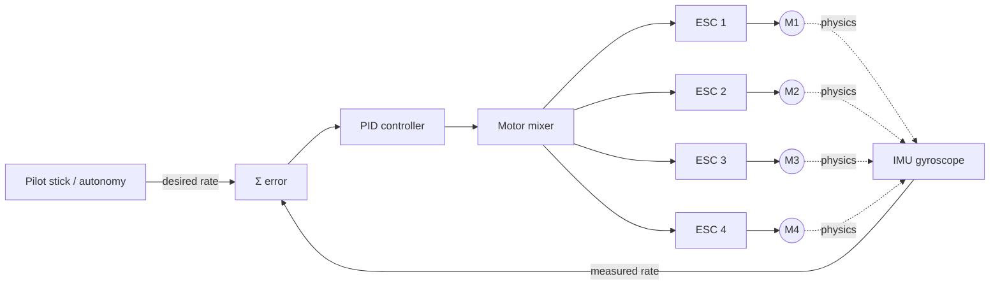
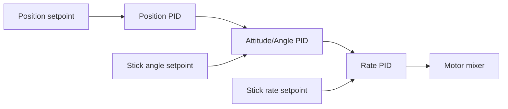

# How Drones Fly

---

## 1. The four forces 

| Force | Source | Acts |
|-------|--------|------|
| **Lift** | Propellers pushing air down | Upward |
| **Weight** | Gravity on mass | Downward |
| **Thrust** | Horizontal component of tilted rotor disk | Forward |
| **Drag** | Air resistance | Opposite to motion |

For a multirotor, **propellers do all the work** — both lifting and propelling. Unlike a plane, there are no wings generating lift from forward motion. That's why a quad falls out of the sky the instant the motors stop, and why it can hover (a fixed-wing cannot).

## 2. Why two CW + two CCW propellers

A spinning prop pushes air down → equal-and-opposite reaction → the *aircraft body* gets twisted in the opposite direction (**reaction torque**). If all four motors spun the same way, the frame would spin underneath them.

So adjacent motors are wired to spin in **opposite directions**, and you use **matched propellers** (a CW prop on a CW motor, a CCW prop on a CCW motor — the blade pitch differs). Net torque around the vertical axis ≈ 0. Two standard layouts:

```
   "Props-In"            "Props-Out"
    CW    CCW              CCW    CW
      \  /                    \  /
       \/                      \/
       /\                      /\
      /  \                    /  \
    CCW    CW              CW    CCW
```

Both work. "Props-out" is common on FPV freestyle because debris from the front props tends to fly outward rather than across the camera view.

## 3. The four control axes

| Axis | Motion | How the FC achieves it |
|------|--------|------------------------|
| **Throttle** | Up / down | All 4 motors faster or slower equally |
| **Roll** | Tilt left/right | Motors on one side slower → that side dips → thrust vector tilts → quad accelerates sideways |
| **Pitch** | Tilt forward/back | Front (or back) motors slower → nose dips → forward acceleration |
| **Yaw** | Rotate around vertical | Speed up the **CW pair**, slow the **CCW pair** (or vice-versa) → unbalanced reaction torque → frame rotates |

Key insight: **translation (going forward) is just rotation (pitching nose down) plus more throttle**. The quad doesn't have a separate "forward" actuator — it tilts and lets its thrust vector pull it along.

## 4. Why a flight controller is mandatory

A quadcopter is **dynamically unstable**. Drop the controller out of the loop and even a perfectly built quad will flip within a second — wind, prop-wash, motor mismatch, or just the inertia of a slight angle will compound until it's upside down.

The flight controller closes a **feedback loop** thousands of times per second:



Per loop iteration (typical 4–8 kHz on modern FCs):
1. Read gyroscope → "how fast am I rotating right now?"
2. Compare to setpoint → "how fast do I *want* to rotate?"
3. **error** = setpoint − measured
4. Run PID on the error → produce a correction
5. **Motor mixer** translates "I need more roll right" into "M1: +5%, M2: −5%, M3: +5%, M4: −5%"
6. Send new throttle to each ESC

## 5. PID in one paragraph each

A PID controller takes a single number — the error — and produces a single number — the correction. It's three terms summed together:

- **P (Proportional):** correction proportional to *current* error. Too low → sluggish, oscillation-damped. Too high → fast but oscillates around the setpoint (visible as wobble).
- **I (Integral):** correction proportional to *accumulated* error over time. Cancels steady offsets (e.g., a heavier payload on one side). Too high → slow oscillations, "bouncing back" after maneuvers.
- **D (Derivative):** correction proportional to the *rate of change* of error. Damps oscillation, acts like a shock absorber. Too high → amplifies noise (hot motors, "burnt" smell after flight is often D-term overcooking the motors).

Each axis (roll, pitch, yaw) has its own independent PID with its own gains. **Tuning** means finding gains that are crisp on input but don't oscillate — and a typical 5" quad needs different gains than a 7" long-range.

## 6. Sensors involved

| Sensor | What it gives | Why the FC needs it |
|--------|---------------|---------------------|
| Gyroscope (3-axis) | Angular *rate* (°/s) | Inner PID loop — fast, low-drift short-term |
| Accelerometer (3-axis) | Linear acceleration (incl. gravity) | Estimate of which way is *down* — corrects gyro drift over time |
| Barometer | Air pressure → altitude | Altitude hold |
| Magnetometer | Magnetic north | Absolute heading (yaw drift correction) |
| GPS | Position + ground velocity | Position hold, waypoints, return-to-home |
| Optical flow / TOF | Lateral motion vs ground | Indoor position hold (no GPS) |

The gyro + accelerometer pair is fused by a **complementary filter** or an **EKF (Extended Kalman Filter)** to give an *attitude estimate* — the FC's belief about its current orientation. Gyro is trusted short-term (fast, accurate, but drifts); accelerometer is trusted long-term (noisy but gravity-anchored). PX4 and ArduPilot use full EKFs (EKF2, EKF3); Betaflight uses a simpler complementary filter, which is enough for a self-leveling acro quad but not for autonomous position hold.

## 7. Two control modes you'll hear about

- **Acro / Rate mode:** stick = desired *rotation rate*. Release the stick and the quad keeps its current angle. Used in FPV freestyle/racing.
- **Angle / Self-level mode:** stick = desired *tilt angle*. Release the stick and the quad returns to level. Used by camera drones and beginners.

The outer "angle" loop simply runs *on top of* the inner "rate" loop, generating rate setpoints from angle errors. Position hold and waypoint nav are yet another layer on top of angle.



## Sources

1. Oscar Liang — *FPV Drone PID Explained* — https://oscarliang.com/pid/
2. StickMan Physics — *The Physics of Drones* — https://stickmanphysics.com/physics-of-drones/
3. DroneZon — *How a Quadcopter Works with Propellers and Motors* — https://www.dronezon.com/learn-about-drones-quadcopters/how-a-quadcopter-works-with-propellers-and-motors-direction-design-explained/
4. PX4 Docs — *Flight Modes* — https://docs.px4.io/main/en/flight_modes/
5. ArduPilot Docs — *EKF (Extended Kalman Filter)* — https://ardupilot.org/dev/docs/extended-kalman-filter.html
