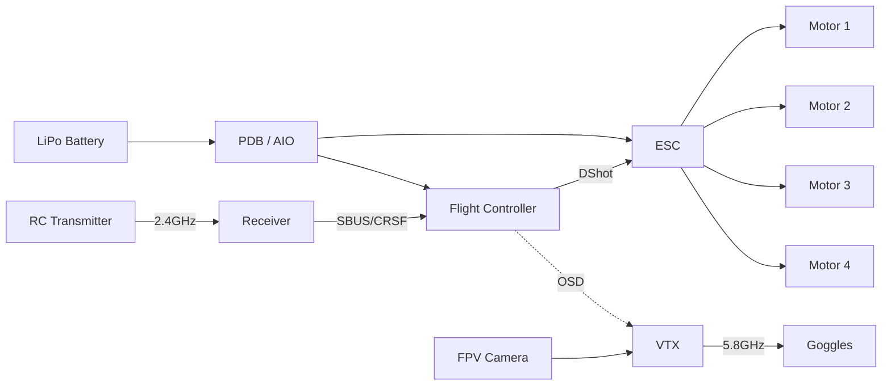

# 01 — FPV Drones

FPV (First-Person View) drones are the learning platform for Phase 1 — small, modular, well-documented, and they expose every layer of the stack.

## Contents
- [frames-motors-props.md](./frames-motors-props.md)
- [radio-vtx-receivers.md](./radio-vtx-receivers.md)
- [batteries-power.md](./batteries-power.md)
- [example-builds.md](./example-builds.md)

## Anatomy of an FPV quad

## Status
🟡 in progress
