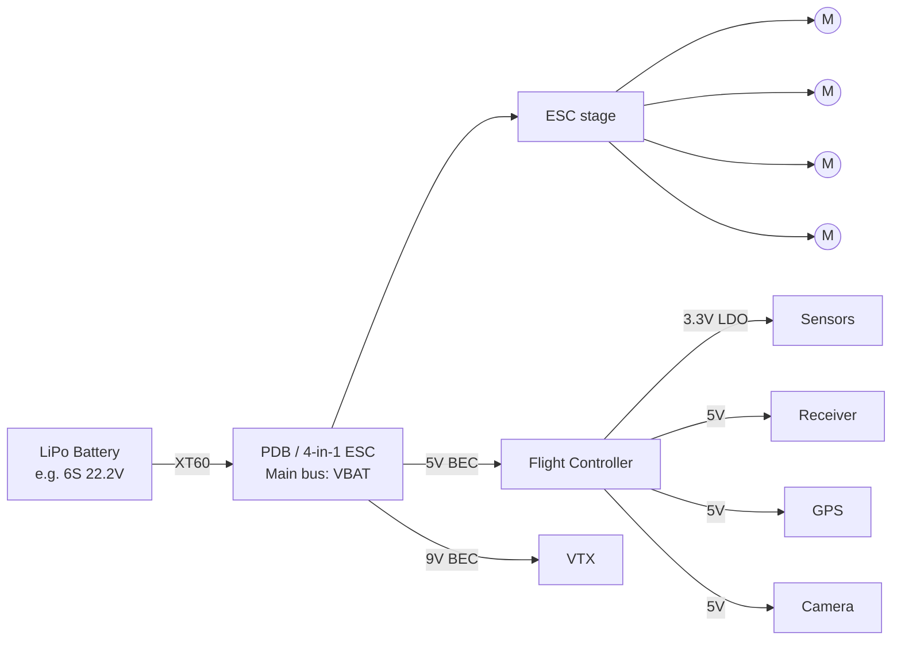

# Batteries & Power Systems

Batteries dominate everything about a drone — its weight, flight time, peak power, even its safety. For FPV class drones, the battery is often **30–40 % of the AUW**. Getting this layer right is the single highest-leverage thing you can do.

---

## 1. Battery chemistries used in UAVs

| Chemistry | Energy density | Power density | Cost | Typical use |
|-----------|--------------:|--------------:|------|-------------|
| **LiPo** (Lithium Polymer) | ~150 Wh/kg | **Very high** (50–150C bursts) | Low | FPV, racing, hover-heavy multirotors |
| **Li-Ion** (cylindrical 18650/21700) | **~250 Wh/kg** | Medium (10–20C) | Medium | Long-range FPV, fixed-wing, cinelifters |
| **LiFePO₄ (LFP)** | ~110 Wh/kg | Medium | Medium | Industrial UAVs needing safety/cycle life |
| Solid-state Li | 300+ Wh/kg | Improving | Very high | Future / not yet hobby-available |

Rule of thumb:
- **LiPo** = punch (hits hard, dies fast)
- **Li-Ion** = endurance (cruises long, no peak power)

---

## 2. Reading a LiPo label

A typical label: **`6S1P 1300 mAh 22.2 V 100C`**

| Field | Meaning |
|-------|---------|
| **6S1P** | **6 cells in Series**, **1 in Parallel** (so 6 cells total) |
| 1300 mAh | Capacity per cell-string (1.3 Ah) |
| 22.2 V | **Nominal** voltage (= S × 3.7 V) |
| 100C | Continuous discharge rating |

### Per-cell voltage
| State | Voltage |
|-------|--------:|
| Fully charged | 4.20 V |
| Nominal | 3.70 V |
| **Land NOW** | **3.50 V (under load)** |
| Damage threshold | 3.30 V |
| Long-term storage | 3.80 V (NEVER store full!) |

A **6S** pack at full: 6 × 4.2 = **25.2 V**. Land by 6 × 3.5 = **21 V** under load.

### C-rating and max current
- **Continuous current** = `C × capacity (Ah)`. So 100C × 1.3 Ah = **130 A continuous**.
- **Burst current** = `burst-C × capacity`. Often quoted (e.g., 200C burst).
- Manufacturer C-ratings are often optimistic — derate by 30–50 % for honesty.

### Voltage sag (the practical truth)
When current is drawn, battery voltage drops below the resting voltage. Sag depends on **internal resistance (IR)**. Healthy pack: <5 mΩ per cell. Old/abused pack: 15+ mΩ → noticeable mid-throttle sag → "punch-out bog".

Buy packs from reputable brands: **CNHL, GNB, Tattu R-line, ManiaX**. Avoid the bottom of AliExpress.

---

## 3. Why the industry moved 4S → 6S

Same power, lower current. Power = V × I, and I² scales the resistive losses. Going from 4S (14.8 V nom) to 6S (22.2 V nom) for the same wattage cuts current by **~33 %**, which means:
- Less heat in wires, connectors, ESCs
- Smaller AWG wire usable
- ESC MOSFETs survive longer (switching losses ∝ V but conduction losses ∝ I²)
- Motor needs **lower KV** to spin the same prop RPM — and low-KV motors are more efficient (fewer copper losses)

Downside: 6S packs need 6S-rated ESCs and chargers. Hardware is the only barrier; everyone has already crossed it.

---

## 4. Li-Ion (18650 / 21700) for long range

For **6"+ long-range / cruising builds**, energy density beats peak power.

| Cell | Diameter × length | Top FPV-grade cell | Capacity | Continuous current |
|------|-------------------|---------------------|---------:|-------------------:|
| **18650** | 18 × 65 mm | Molicel P28A | 2800 mAh | 35 A |
| **21700** | 21 × 70 mm | **Molicel P45B** | **4500 mAh** | **45 A** |

A **6S2P** 21700 pack = **9000 mAh at 22.2 V** ≈ **200 Wh** — roughly **4–5× a 1300 mAh 6S LiPo** at ~2× the weight. On a 7" build that's **20–30 min flight** or **35+ km range**.

When *not* to use Li-Ion:
- 5" freestyle / racing — peak current demands exceed comfortable Li-Ion discharge
- Anything that needs snappy throttle response — Li-Ion sags under sudden load
- Builds under 4S — Li-Ion really shines at 6S+ for the voltage-sag-at-low-current regime

---

## 5. Power distribution on the drone

### Rails on a typical FC/ESC
| Rail | Loads | Source |
|------|-------|--------|
| **VBAT** (battery direct) | ESC motor drive | Direct from battery |
| **9 V** | Digital VTX (DJI O3/O4, HDZero) | Onboard buck on PDB or AIO |
| **5 V** | FC logic, RX, GPS, camera, LEDs | Buck regulator (3 A typical) |
| **3.3 V** | MCU, sensors | LDO downstream of 5 V |

### Current sensing for telemetry
A small **shunt resistor** (often 1 mΩ) in series with the battery + an **INA226** or op-amp lets the FC report instantaneous current and integrate it to mAh used. Essential for autonomous flight (battery failsafe) and useful even for FPV (predicting flight time).

### Capacitors
A **low-ESR electrolytic capacitor** (typically 35 V 470–1000 µF for 6S) across battery input *near the ESCs* smooths spikes from PWM switching. Without it: high-frequency noise on VBAT → bad video, occasional brownouts. **Never fly without it.**

---

## 6. Connectors

| Connector | Continuous A | Use |
|-----------|------------:|-----|
| PH 2.0 / JST-PH | ~3 | Tinywhoop 1S |
| BT2.0 / GNB27 / A30 | 10–20 | 1S / 2S micro |
| **XT30** | **~15** | 2–3" |
| **XT60** | **~30** | **5" freestyle (default)** |
| XT90 | ~60 | Heavy-lift, long-range Li-Ion |
| AS150 / EC5 | 100+ | Industrial |

Always solder battery leads with **silicone-insulated wire** (16 AWG for 5" XT60, 14 AWG for heavier). Silicone survives heat; PVC melts when soldering.

---

## 7. Charging & safety

- Always **balance charge** — a charger that monitors per-cell voltage and equalises them. A pack with one cell at 4.2 V and others at 4.0 V will degrade fast and may eventually puff.
- Charge rate: **1C is safe**, up to the manufacturer's max. (1.3 Ah pack at 1C = 1.3 A charge.)
- **Storage charge** to 3.80 V/cell if not flying for >2 days. LiPos left full or empty degrade quickly.
- Charge inside a **LiPo bag** or ammo can. A failure (rare but real) is a violent flame jet.
- Inspect packs: puffy = retire immediately. Damaged wrapper = re-wrap. Pierced cell = dispose (salt-water discharge, then e-waste).

---

## 8. Sizing a battery for a build

Cheat sheet for a 5" freestyle:

| Capacity (6S) | Weight | Flight time | Use |
|--------------:|-------:|------------:|-----|
| 850 mAh | ~120 g | 2–3 min | Racing (light, punchy) |
| **1300 mAh** | **~180 g** | **3–5 min** | **Freestyle default** |
| 1550 mAh | ~210 g | 4–6 min | Freestyle / cinematic |
| 1800 mAh | ~240 g | 5–7 min | Cruising / cinematic |

For a 7" long-range build, swap to 4S–6S Li-Ion (e.g. **6S2P P45B** = ~600 g, 20–30 min).

---

## 9. What this means for Phase 2

- **System 1 (Commercial FC):** Must support **smart batteries** — talking over **SMBus** or **DroneCAN** to read state-of-charge, cycle count, cell voltages directly from a BMS-equipped pack. Pixhawk's "Smart Battery" standard exists for exactly this.
- **System 2 (Lightweight AIO):** Provide on-board **current sensing (≥120 A range)** for 6S 5" drones, and integrate the **9 V VTX rail** so users don't need a second board. Capacitor footprint near ESC stage is mandatory.

## Sources
1. ChinaHobbyLine — *LiPo C Rating Explained* — https://chinahobbyline.com/blogs/news/30c-vs-100c-vs-130c-rc-battery-guide
2. BrushlessWhoop — *LiPo Battery Specs and what they mean* — https://brushlesswhoop.com/blog/battery-specifications/
3. Oscar Liang — *6S vs 4S LiPo for FPV* — https://oscarliang.com/6s-mini-quad-racing-drone/
4. Oscar Liang — *Li-ion Battery Packs for Long Range* — https://oscarliang.com/li-ion-battery-long-range/
5. UAVMODEL — *Li-Ion Packs for Long-Range FPV (2026)* — https://blog.uavmodel.com/li-ion-battery-packs-for-long-range-fpv-18650-vs-21700-cell-selection-spot-welding-and-range-estimation-2026-guide/
6. ChinaHobbyLine — *LiPo vs Li-ion* — https://chinahobbyline.com/blogs/news/lipo-vs-li-ion-batteries
