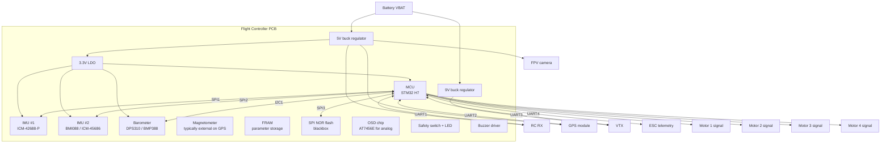

# Flight Controller Internals & Peripherals

What's actually *inside* an FC PCB, and what hangs off it. This note is written from a hardware-designer's perspective — by the end you should be able to look at an FC schematic and identify every functional block.

---

## 1. Block diagram of a "generic" modern FC

This is roughly what you'll see on a SpeedyBee or Holybro Kakute. A Pixhawk-class FC adds: a *third* IMU, a *second* baro, an FRAM for atomic parameter writes, a DroneCAN transceiver, ethernet PHY, and dual power inputs with diode-OR.

---

## 2. Inside the FC — components by function

### MCU (the brain)
- Runs the firmware main loop.
- Has its own peripherals: timers (for motor PWM/DShot generation), DMA (for high-speed sensor reads), UARTs, SPI, I²C, ADC, CAN.
- Key spec: **timer count** — each motor output needs one timer channel; modern FCs need 8+ channels.

### IMU (Inertial Measurement Unit)
- 6-axis (gyro + accel) or 9-axis (+ magnetometer) MEMS sensor.
- Always on **SPI** in modern FCs (I²C too slow for 8 kHz gyro reads).
- Two-FIFO IMUs (ICM-42688-P) buffer samples internally — MCU reads in batches via DMA → reduces interrupt rate.
- **Why redundancy** (Pixhawk approach):
  - Different vendors → different failure modes (a Bosch sensor and an InvenSense sensor are unlikely to fail the same way).
  - EKF can detect a divergent IMU and exclude it.
  - For critical commercial vehicles, **triple IMU** with majority voting is the gold standard.

### Barometer
- Measures absolute air pressure → derived altitude (~10 cm resolution at sea level).
- **Sensitive to airflow** — must be vented through the case but shielded from prop-wash. Often covered by a small foam square.
- **BMP388 / DPS310** are current defaults.

### Magnetometer
- Measures Earth's magnetic field for heading reference.
- **Almost never on the FC PCB** in modern designs — current from ESCs/motors creates a huge magnetic field that swamps Earth's ~50 µT.
- **Mounted externally** — typically inside the GPS module on a tall stalk, far from power wiring.

### FRAM (Ferroelectric RAM)
- Non-volatile, byte-writable, infinite endurance.
- Used to store **parameters that must survive a brownout mid-write** (e.g., during a hard landing).
- Avoids the "parameter file corruption" failure mode that flash-based storage has.
- Pixhawk standard; not present on FPV FCs.

### Blackbox flash
- SPI NOR flash (W25Q128 = 16 MB is common) — stores PID/gyro/RC traces for post-flight tuning.
- Higher-end FCs have an SD card slot for longer logs.
- ArduPilot/PX4 also log to SD; Betaflight to onboard flash.

### OSD (On-Screen Display)
- For analog VTX: dedicated chip (**AT7456E**, clone of MAX7456) overlays text on the camera video.
- For digital VTX (DJI/Walksnail/HDZero): no dedicated chip — the MCU sends text over UART using **MSP DisplayPort** protocol; the goggle does the overlay.

### Power circuitry
- **VBAT in** → typically protected with reverse-polarity FET and a TVS diode.
- **Bulk capacitor** across VBAT near input (35 V 470–1000 µF for 6S).
- **Buck regulators** for 5 V and 9 V rails (typical: TPS54331, MPS MP2459, or modules).
- **LDO** for 3.3 V (often integrated in MCU section).
- **Power module input** (Pixhawk-class) — 6-pin Molex CLIK-Mate with VBAT, GND, V_servo, I_sense, V_sense, and a separate isolated rail.

### Voltage/current sensing
- **Voltage divider** on VBAT → ADC input on MCU.
- **Shunt resistor** (~1 mΩ) in series with main current path → INA226 / op-amp → ADC.
- Required for accurate battery telemetry, autonomous-flight failsafes, and `mAh used` integration.

### Communication buses (the pinouts you wire to)
| Bus | Speed | Devices |
|-----|-------|---------|
| UART | 50 kbps – 6 Mbps | RX, VTX, GPS, ESC telem, MAVLink telem |
| SPI | 10–50 MHz | IMU, blackbox flash |
| I²C | 100 kHz – 1 MHz | Barometer, external mag, OLED |
| CAN / CAN-FD | 1–8 Mbps | DroneCAN smart peripherals |
| Ethernet (Pixhawk-class) | 100 Mbit | Companion computer link |

### Status indicators
- **RGB status LED** — boot state, GPS lock, arming
- **Buzzer / piezo** — pre-arm warning, low-battery beep, lost-model finder
- **Safety switch** (Pixhawk) — hardware arming interlock

---

## 3. Outside the FC — common peripherals

### GPS module
- Almost always a **u-blox** chipset: NEO-M8N (legacy), **NEO-M9N** (current mid-range), **NEO-M10** (latest, multi-band).
- Often combined with **external magnetometer** + safety switch + RGB LED on a single carrier board.
- Connects via UART (NMEA or UBX protocol) + I²C (for the mag).

### Telemetry radio (Pixhawk-class autonomy)
- **SiK telemetry radios** — 433 MHz / 915 MHz pair, one on the drone, one on the GCS laptop.
- Carry **MAVLink** between FC and ground station for live telemetry and command.
- Distinct from the RC link (which is for stick inputs).

### RC receiver
- See [`../01_FPV_Drones/radio-vtx-receivers.md`](../01_FPV_Drones/radio-vtx-receivers.md).
- Wires: VCC, GND, UART (CRSF) or SBUS-inverted.

### ESC (off-board or 4-in-1)
- Receives motor commands over PWM or DShot.
- Returns ESC telemetry (RPM, voltage, current, temperature) over a single UART using KISS/BLHeli telem protocol.

### Companion computer
- Raspberry Pi 4/5, NVIDIA Jetson Orin Nano, Khadas, etc.
- Connects via **UART (MAVLink)** or **Ethernet** (Pixhawk 6X+).
- Runs ROS 2, MAVSDK, vision pipelines, mission logic.

### Smart battery (Pixhawk Smart Battery standard)
- BMS-equipped pack with onboard fuel gauge.
- Talks to FC over **SMBus** or **DroneCAN**.
- Reports cell voltages, state-of-charge, cycle count, temperature.

---

## 4. Redundancy patterns for commercial-grade design

Phase 2's System 1 brief calls out "**Reliable operation, redundant sensors**". The Pixhawk 6X recipe:

| Element | How it's redundant |
|---------|-------------------|
| IMU | **Triple** — InvenSense ICM-45686 + ICM-42688P + Bosch BMI088. Different vendors. |
| Bus | Each IMU on a **separate SPI bus** (no shared failure mode). |
| Barometer | **Dual** — different parts (BMP388 + DPS310). |
| Power | **Dual VBAT input** with diode-OR; isolated rails for IMU, FMU, IO. |
| Storage | FRAM (params) + SD (logs) — neither can lose the other. |
| MCU | (Some certified-class boards have **dual MCU** with a watchdog companion. Not Pixhawk 6X.) |

**EKF behaviour:** PX4's EKF2 monitors per-IMU innovation residuals. If one sensor diverges (broken, saturated, etc.), it's voted out and the EKF continues on the remaining two. This is the whole point of triple redundancy.

---

## 5. Signal-integrity considerations (relevant to Phase 2 design)

These are the things that bite you in PCB layout:

1. **IMU isolation from ESC switching noise** — IMU on its own copper pour, away from buck regulator switching nodes. Some designs use a separate ground plane connected to main GND through a single point.
2. **Crystal placement** for the MCU — short traces, guard ring grounded.
3. **Star-grounding** for sensor analog GND — share at one point with digital GND.
4. **Decoupling caps** — 100 nF on every IC power pin, 10 µF bulk near each chip.
5. **Bulk cap on VBAT** — low-ESR electrolytic near ESC input. Without it: ringing on VBAT under fast prop-RPM changes, brownouts, noisy video.
6. **PWM/DShot trace impedance** — DShot is digital but at high data rates needs short, well-grounded traces.
7. **CAN-bus termination** — 120 Ω at each end of the bus (autopilot end + smart-peripheral end).
8. **Differential pairs** for USB and ethernet — controlled impedance, matched lengths.

---

## 6. What to take away

A modern FC is, in essence, a small embedded computer with:
- One MCU (the brain)
- Several sensors on private SPI buses (the senses)
- A handful of UARTs (the I/O for everything wireless)
- A power subsystem (the muscle)
- And a *lot* of PCB-layout discipline to keep noise out of the sensors

**For Phase 2 design:** start by drawing this block diagram for your target FC, fill in part numbers, then build the schematic from it. The diagram *is* the spec.

## Sources
1. Holybro Pixhawk 6X technical docs — https://docs.holybro.com/autopilot/pixhawk-6x
2. Pixhawk Standards GitHub — https://github.com/pixhawk/Pixhawk-Standards
3. PX4 — *Reference Flight Controller Design* — https://docs.px4.io/main/en/hardware/reference_design
4. Betaflight — *Manufacturer Design Guidelines* — https://betaflight.com/docs/development/manufacturer/manufacturer-design-guidelines
5. ArduPilot — *EKF (Extended Kalman Filter)* — https://ardupilot.org/dev/docs/extended-kalman-filter.html
6. InvenSense ICM-42688-P datasheet — https://invensense.tdk.com/products/motion-tracking/6-axis/icm-42688-p/
