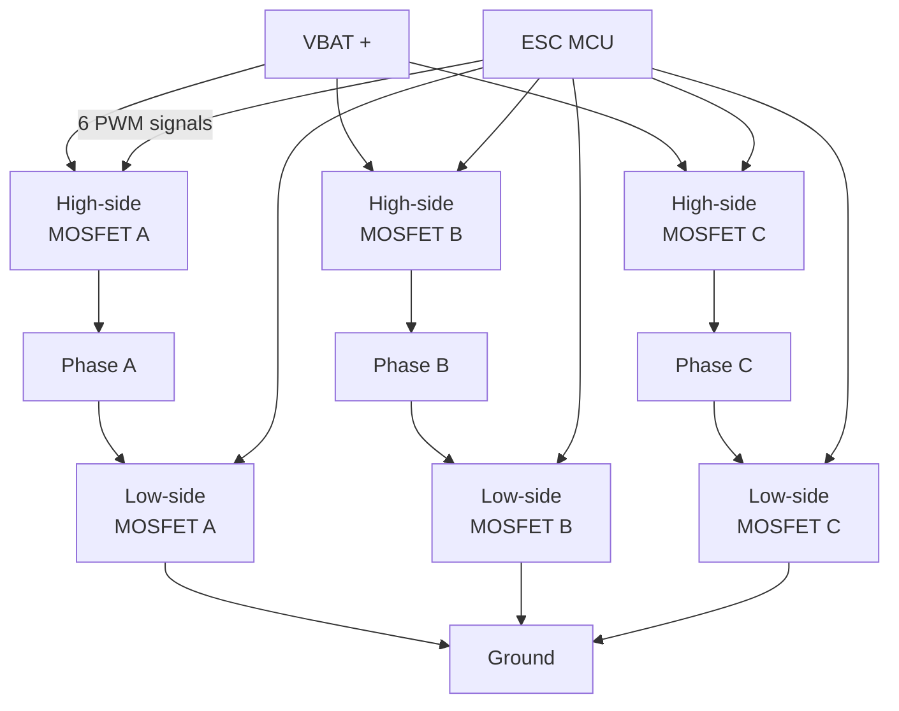

# ESC Architectures

An **ESC (Electronic Speed Controller)** translates a low-power digital command from the FC ("motor 1 at 47 % throttle") into a high-current 3-phase drive that spins a brushless DC motor. It's the muscle between the FC's brain and the motor.

Understanding ESCs requires understanding:
1. How a brushless DC motor works
2. How a 3-phase inverter drives it
3. How the firmware decides *when* to switch each MOSFET
4. How that translates into PCB-level design tradeoffs

---

## 1. Brushless DC (BLDC) motor — 30 seconds

Unlike a brushed motor (DC + carbon brushes that physically commutate windings), a **BLDC** has:
- **Stator**: 3 sets of windings (phase A, B, C), arranged 120° apart electrically.
- **Rotor**: permanent magnets.
- **No brushes** — commutation is done *electronically* by the ESC.

By energising the windings in a rotating sequence, the stator creates a rotating magnetic field that drags the rotor magnets around. Faster sequence → faster motor.

**Why brushless?** No brush wear, no sparks, higher efficiency, higher power density. The catch: you need an external controller to handle commutation — that's the ESC.

---

## 2. The 3-phase inverter (the hardware)

Six MOSFETs arranged as **three half-bridges**. For each phase: one transistor pulls the line *up* to battery voltage, the other pulls it *down* to ground.

At any instant in a 6-step commutation:
- **One phase is being driven HIGH** (PWMed against battery)
- **One phase is being driven LOW** (PWMed against ground)
- **One phase is FLOATING** (both its MOSFETs off — used to sense back-EMF)

Rotating which-phase-is-which through the **6-step sequence** (AB, AC, BC, BA, CA, CB) makes the rotor spin. Each full electrical cycle = one rotor revolution, *divided by* the motor's pole-pair count (typical 5–7 for FPV motors).

### Why MOSFETs (not BJTs, not IGBTs)?
- **MOSFETs** — low Rds(on) (0.5–5 mΩ in modern parts), fast switching, voltage-controlled gate. Sweet spot for 6S/100A applications.
- BJTs — too slow, too lossy.
- IGBTs — better for >100 V / >100 A industrial use; overkill for hobby drones.

### Key MOSFET specs for ESC design
| Spec | Why it matters |
|------|----------------|
| **Rds(on)** | Lower → less conduction loss → less heat. Aim ≤2 mΩ at gate-drive Vgs. |
| **Vds** | Must exceed VBAT × 1.5 with safety margin. For 6S (25 V max), pick 40 V+. |
| **Qg (gate charge)** | Lower → faster switching → less switching loss, less heat |
| **Continuous Id** | Must exceed worst-case phase current |
| Package | DFN-5×6 or similar low-inductance package for high freq |

Popular 6S 60 A class: **TOSHIBA TPHR8504PL**, **Infineon BSC050N03LSG**, **Magnachip MX25Q63A**. PCB layout matters as much as part choice.

---

## 3. How the ESC firmware decides when to switch

### Sensorless commutation via back-EMF (BEMF)
A spinning permanent-magnet rotor *induces voltage* in the un-driven (floating) winding — this is **back-EMF**. The waveform crosses zero exactly halfway between commutation events. The ESC firmware:

1. Reads the floating-phase voltage through a divider into an ADC or comparator.
2. Detects the **zero-crossing**.
3. Waits 30° electrical (one-sixth of an electrical period, computed from recent revs).
4. Triggers the next 6-step commutation.

This is **trapezoidal / 6-step commutation** — what BLHeli_S, BLHeli_32, AM32, Bluejay all use today. Cheap, simple, robust above a few hundred RPM.

### The problem: zero RPM
With no rotation, there's no back-EMF, so the ESC can't sense position. Solutions:
- **Open-loop ramp-up:** ESC blindly steps through commutations for ~10 ms, hoping the rotor follows. Works for unloaded BLDC motors.
- **Aligned start:** First energise the rotor to a known position, then ramp.
- **High-frequency injection** (advanced, FOC-only): inject a small AC test signal, measure inductance variation to deduce position even at standstill. Not used in hobby ESCs yet.

### Trapezoidal vs sinusoidal vs FOC

| Drive method | What it does | Used by |
|--------------|-------------|---------|
| **Trapezoidal (6-step)** | 3 phases switched in discrete steps; non-sinusoidal current waveform | **BLHeli_S, BLHeli_32, AM32, Bluejay** — hobby standard |
| Sinusoidal | All 3 phases driven with continuous sine waves, 120° apart | Some industrial servo drives |
| **FOC (Field-Oriented Control)** | Closed-loop sinusoidal current control, decouples torque/flux | **VESC, SimpleFOC**, industrial servo, e-bikes |

**Why hobby drones don't use FOC:**
FOC is smoother, more efficient, and quieter — but it needs current sensing on each phase (more shunt resistors and ADCs), a more powerful MCU, and a slower PID loop. For the 50 kHz commutation rates of an FPV motor at 30 000 RPM, the per-cycle compute budget is tight.

That said, **AM32 is starting to add FOC modes** for hobby use — this is where ESC firmware is going next.

---

## 4. 4-in-1 vs Individual ESCs

| Aspect | 4-in-1 | Individual (4 × single) |
|--------|--------|------------------------|
| **Weight** | Lower (single PCB) | Higher |
| **Wiring** | Clean — one connector to FC | Messy — 4× signal + 4× telem |
| **Heat dissipation** | Concentrated in one spot | Distributed across 4 PCBs |
| **EMI** | All switching on one board, near sensors | Each ESC noise contained on its own arm |
| **Failure mode** | Lose 1 phase → entire 4-in-1 may go down | Lose 1 ESC → still flying on 3 (some firmwares can fly a 4→3 graceful land) |
| **Repairability** | Replace whole board | Replace just the broken one |
| **Cost (in volume)** | Lower BOM | Higher |
| **Vibration tolerance** | Single mounting point | Mounted on arms (more vibration on devices, but also fewer through-PCB connections) |
| **Common in** | FPV, sub-1 kg multirotors | Heavy-lift, industrial, hex/octo, agriculture |

Modern FPV defaults to **4-in-1**. Industrial/heavy-lift defaults to individual ESCs, often potted in epoxy, mounted on each arm with their own heat sink.

---

## 5. ESC architecture spec sheet — what every datasheet lists

When evaluating an ESC for a design or purchase:

| Spec | Meaning | Typical for 5" 6S |
|------|---------|------------------|
| **Continuous current** | Sustained per-channel A rating | 45–55 A |
| **Burst current** | Short (10 s) peak rating | 60–70 A |
| **Voltage range** | Battery compatibility | 3–6S (12–25 V) |
| **MCU** | Determines firmware options | EFM8BB2 (BLHeli_S), ARM Cortex-M (BLHeli_32/AM32) |
| **PWM frequency** | Switching freq of the inverter | 24–48 kHz |
| **Supported protocols** | DShot150/300/600/1200, Bidir DShot | DShot600 standard |
| **Telemetry** | KISS / BLHeli telem over UART | Yes (modern boards) |
| **Onboard current sensor** | Reports actual phase current | Yes (most 4-in-1) |
| **Capacitor** | Low-ESR for VBAT decoupling | 35 V 470–1000 µF |
| **Weight** | g | 8–15 g (4-in-1) |
| **Mounting** | Hole pattern | 20×20 / 30.5×30.5 to match FC |

---

## 6. What this means for Phase 2 design

### System 1 (Commercial FC, separate from ESCs)
The FC doesn't have ESCs onboard — it talks to off-board ESCs via:
- **DShot or PWM** for motor command
- **DroneCAN / UAVCAN** for high-end smart ESCs (current/voltage/RPM/temperature telemetry per ESC)
- For redundancy: each ESC on its own DroneCAN node ID; an ESC failure detected via missed telemetry.

### System 2 (Lightweight AIO with onboard 4-in-1 ESC)
Designing the ESC stage requires:
- Pick MOSFETs (e.g., **TOSHIBA TPHR8504PL** — 30 V, 1.85 mΩ, 70 A) — 6 per phase × 4 motors = **24 MOSFETs**
- Gate drivers (typically integrated into the ESC MCU's PWM peripherals, or external like FAN73892)
- 4× ESC MCUs (one per motor) — **AT32F421** or **STM32G071** for AM32 compatibility
- 4× current shunt resistors with op-amp amplification
- Beefy ground/power planes — bottom layer copper pour for thermal mass
- Low-ESR bulk caps placed close to MOSFETs
- Single connector to the FC section (signal + telemetry UART per channel, or a multiplexed scheme)

The whole AIO PCB layout is dominated by this ESC stage — high currents demand wide traces and via-stitching, which sets the minimum PCB size.

---

## Sources
1. DigiKey — *Controlling Sensorless BLDC Motors via Back-EMF* — https://www.digikey.com/en/articles/controlling-sensorless-bldc-motors-via-back-emf
2. NXP AN1914 — *3-Phase BLDC Motor Control with Sensorless Back EMF* — https://www.nxp.com/docs/en/application-note/AN1914.pdf
3. NXP AN5394 — *Sensorless BLDC Control for ESC* — https://www.nxp.com/docs/en/application-note/AN5394.pdf
4. DeepBlue Embedded — *STM32 ESC PCB Design (FOC ESC for BLDC)* — https://deepbluembedded.com/stm32-esc-pcb-design-foc-esc-bldc-schematic/
5. Texas Instruments — *Trapezoidal vs FOC commutation* — https://www.ti.com/motor-drivers/brushless-dc-bldc-drivers/overview.html
6. Oscar Liang — *FPV ESC explained* — https://oscarliang.com/esc/
