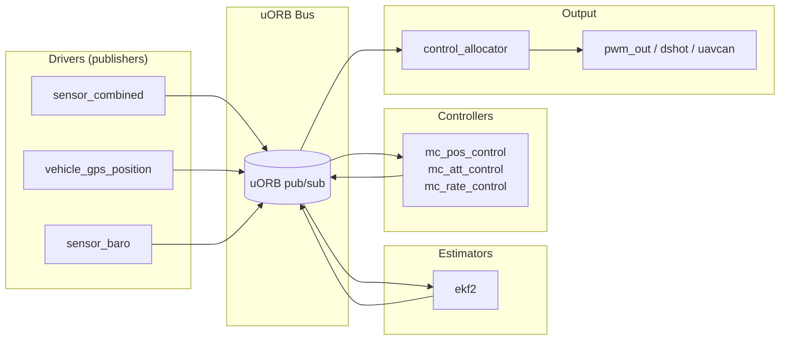

# PX4

> Born at ETH Zurich (2008–2011), now governed by the **Dronecode Foundation**. The flight stack designed alongside (and named for) the Pixhawk hardware standard. **BSD/Apache-2.0 licensed** — the autopilot of choice for closed-source commercial products.

If ArduPilot is "the everything autopilot for the community", PX4 is "the modular autopilot for industry".

---

## 1. Philosophy

- **Modular by design.** Drivers, estimators, controllers, mixers — each is a *module* talking through a publish/subscribe bus.
- **BSD/Apache-2.0 licensed** — commercial-friendly. Companies can ship modified PX4 without publishing source.
- **Research-friendly** — used heavily in academic robotics, drone-delivery (Amazon MK30, Zipline Sparrow), and defense.
- **Native ROS 2** integration via uXRCE-DDS — newest stacks treat PX4 as a fully ROS-2-aware node.

---

## 2. Architecture: uORB and modules

PX4's defining architectural choice is **uORB** — a **publish/subscribe message bus** that decouples modules.

- Each module runs as its own task (NuttX thread).
- Modules **don't know about each other** — they publish and subscribe to topics on uORB.
- Easy to add a new module (e.g., a custom estimator) without touching anything else.
- Easy to swap a module (e.g., replace `ekf2` with your own).

This is *radically* different from Betaflight's monolithic main loop and even more modular than ArduPilot's vehicle classes.

---

## 3. RTOS: NuttX

PX4 primarily runs on **NuttX** — an Apache-licensed POSIX-API real-time OS originally written by Greg Nutt.

| Feature | NuttX |
|---------|-------|
| License | BSD-style (Apache) |
| Footprint | Scales from 8-bit to 64-bit |
| POSIX | Yes — you can write modules with `pthread`, `open()`, `read()`, etc. |
| Scheduler | FIFO + round-robin priority |
| Used in | PX4, Sony cameras, Xiaomi router firmware, others |

PX4 also has POSIX builds (for SITL on Linux/macOS), QuRT builds (Qualcomm DSP), and integrates with Linux companion-side via uORB-over-DDS.

---

## 4. Strengths

- **License** — BSD/Apache lets you ship a closed-source commercial fork.
- **uORB modularity** — fastest dev-loop for adding new estimators / controllers / drivers.
- **Native ROS 2 via uXRCE-DDS** (PX4 v1.14+) — companion code is plain ROS 2, no custom bridge.
- **QGroundControl** — the canonical GCS, cross-platform.
- **SITL + Gazebo / jMAVSim** simulators — great test environment.
- **Strong industry backing** — Auterion (built atop PX4) is a commercial integrator; many delivery-drone companies use it.

---

## 5. Weaknesses

- **Smaller community** than ArduPilot.
- **Fewer vehicle types** out of the box (no rover/sub/heli equivalent in feature parity).
- **Steeper for first-time users** than INAV/Betaflight (but comparable to ArduPilot).
- Hardware compatibility is **narrower** — really wants a Pixhawk-class FMU; FPV-grade FCs supported but not the priority.
- Recent **active churn** — versioning between v1.13/v1.14/v1.15 introduced breaking changes for some users.

---

## 6. License: BSD-3 + Apache-2.0 (the practical implication)

You can:
- Fork PX4, modify it, sell drones running your fork, **and never publish your changes**.
- Replace modules wholesale (your own EKF, your own controller).
- Build a proprietary fork (Auterion does this).

You must:
- Preserve copyright notices.
- Not misrepresent authorship.

For **defense, export-controlled, or IP-sensitive** products, PX4 is essentially the only mature open-source choice.

---

## 7. Hardware support

- All Pixhawk FMU revs (v2 through v6X-RT).
- Cube Orange/Orange+ (CubePilot).
- Holybro Durandal, Pix32 v6.
- ModalAI VOXL2 (integrated autopilot + companion).
- A few FPV-grade boards (Kakute H7, with limitations).

Build system: **CMake + custom Python wrappers**. `make px4_fmu-v6x_default` for the standard target.

---

## 8. Tooling

- **QGroundControl** — primary cross-platform GCS.
- **PX4 Console (NSH shell)** — log into the autopilot over USB or radio for live debugging.
- **MAVSDK** — high-level SDK for talking to PX4 from external apps (C++, Python, Swift, Java, Go).
- **PX4-Autopilot SITL** — full simulation environment (Gazebo, jMAVSim, AirSim).
- **Flight Review** (https://review.px4.io) — drag-and-drop ULog analysis online.
- **PX4 ROS 2 stack** — via micro-ROS-Agent + uXRCE-DDS.

---

## 9. When to use PX4

| If the drone is... | Use PX4? |
|--------------------|:--------:|
| Commercial product needing closed source | ✅ Strongly |
| Research with ROS 2 / Gazebo / vision | ✅ Default |
| Delivery / industrial multirotor at scale | ✅ |
| Defense (export-controlled) | ✅ |
| Hobby long-range or mapping | ⚠️ ArduPilot is more mature |
| Heavy-lift agricultural | ⚠️ ArduPilot leads here |
| Fixed-wing FPV / wing | ⚠️ INAV is simpler |
| Pure FPV racing | ❌ Betaflight |

---

## 10. PX4 vs ArduPilot — head to head

| Axis | PX4 | ArduPilot |
|------|-----|-----------|
| License | **BSD/Apache** (commercial-friendly) | GPLv3 (must share modifications) |
| Architecture | Modular (uORB pub/sub) | Vehicle-class C++ |
| RTOS | NuttX | ChibiOS |
| Estimator | EKF2 (mature) | EKF3 (24-state, more features) |
| Vehicles | Multirotor, plane, VTOL, rover (partial) | All of those + sub + heli + blimp |
| ROS 2 | **Native (uXRCE-DDS)** | Via MAVROS bridge |
| Community | Smaller, more commercial | Larger, more diverse |
| Industry users | Amazon Prime Air, Zipline, Skydio (historical), Auterion | Most ag-spray, mapping, large UAS |
| GCS | QGroundControl | Mission Planner + QGroundControl |

There's no single "winner" — they target different market segments. For Phase 2's **System 1 Commercial FC**, supporting **both** is the smart choice. The hardware doesn't care — board definitions go into both upstream codebases.

---

## 11. For Phase 2

The System 1 FC should:
- **Conform to FMUv6X** standard → both PX4 and ArduPilot will compile for it.
- Submit board definitions to **both** upstream projects:
  - PX4: `boards/<vendor>/<board>/` directory
  - ArduPilot: `libraries/AP_HAL_ChibiOS/hwdef/<board>/`
- Primary GCS: **QGroundControl** (works with both PX4 and ArduPilot).
- For ROS 2 / autonomy demos: PX4 + micro-ROS is the path of least resistance.

## Sources
1. PX4.io — https://px4.io/
2. PX4 Docs — https://docs.px4.io/
3. PX4 GitHub — https://github.com/PX4/PX4-Autopilot
4. PX4 Architectural Overview — https://docs.px4.io/main/en/concept/architecture
5. PX4 uORB Messaging — https://docs.px4.io/main/en/middleware/uorb
6. PX4 ROS 2 / uXRCE-DDS — https://docs.px4.io/main/en/ros2/
7. NuttX RTOS — https://nuttx.apache.org/
8. MAVSDK — https://mavsdk.mavlink.io/
9. PX4 vs ArduPilot 2026 — https://thinkrobotics.com/blogs/learn/px4-vs-ardupilot-complete-comparison-guide-for-drone-developers
10. Meier et al., "PX4: A Node-Based Multithreaded Open Source Robotics Framework" — https://people.inf.ethz.ch/pomarc/pubs/MeierICRA15.pdf
