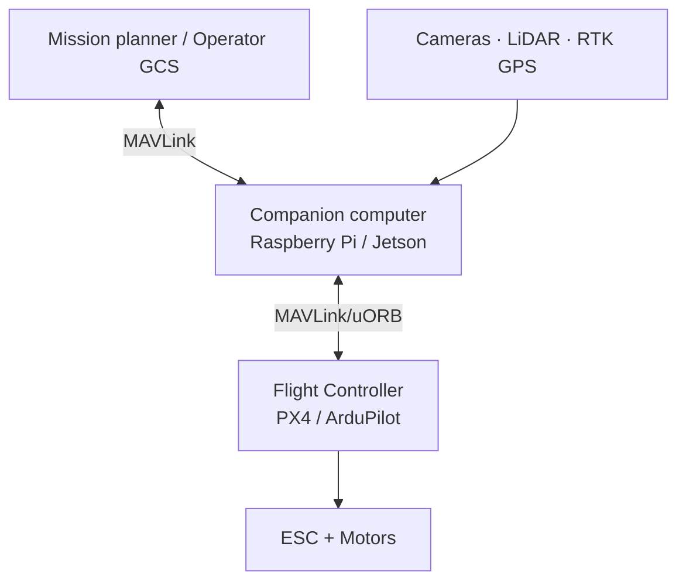

# 06 — Autonomous Stacks

What sits *above* the flight controller for autonomy: companion computers, mission planning, perception, and the protocols that glue them together.

## Layers

## Key protocols
| Protocol | Use |
|----------|-----|
| MAVLink | FC ↔ GCS / FC ↔ companion |
| MAVSDK | High-level SDK over MAVLink (C++/Python/Swift) |
| ROS / ROS 2 | Robotics middleware on companion |
| DroneCAN / CAN-FD | Smart peripherals (ESCs, GPS, BMS) |
| micro-ROS / uXRCE-DDS | ROS 2 on the FC itself (PX4 v1.14+) |

## Common companion computers
- Raspberry Pi 4/5 — cheap, big community
- NVIDIA Jetson Orin Nano / NX — vision/inference workloads
- Khadas VIM4, Radxa Rock — alternatives

## Sources
- https://mavlink.io/
- https://docs.px4.io/main/en/ros2/
- https://github.com/mavlink/MAVSDK
