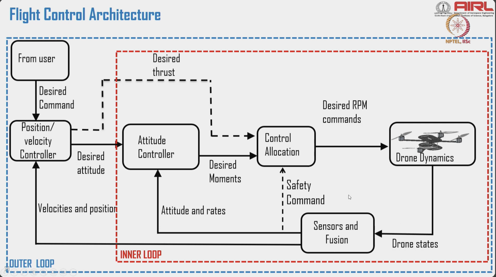

# Applications of Rotation in Drone Operations

> Source: NPTEL — Drone Systems and Control (IISc)

---

## Rotation (Orientation Control)

Refers to changing the drone's orientation in space — described by three angles:

| Axis | Rotation | What it looks like |
|------|----------|--------------------|
| X (longitudinal) | **Roll** | Tilting left/right |
| Y (lateral) | **Pitch** | Nosing up/down |
| Z (vertical) | **Yaw** | Spinning left/right on the spot |

---

## Why It Matters

- Face a camera or sensor in the correct direction (payload pointing)
- Stabilise mid-air — especially in wind (disturbance rejection)

---

## Reference Frames

| Frame | Fixed to | Used for |
|-------|----------|----------|
| **Inertial (World)** | Ground — does not move with the drone | GPS, navigation, mapping |
| **Body (Local)** | Drone centre of mass — moves with it | Force, torque, control calculations |

Two common inertial frame conventions used in UAVs:

### ENU — East-North-Up
- X → East, Y → North, Z → Up
- Tangent-plane, centered at a reference point on Earth's surface; does not rotate with UAV
- Used in: GPS navigation, geographic mapping, GIS, ROS (default)

### NED — North-East-Down
- X → North, Y → East, Z → Down (altitude *decreases* as Z increases — aviation convention)
- Moves with the UAV but stays aligned to Earth's NED directions
- Used in: UAV autopilots, flight control systems, ArduPilot/PX4 (default)
- **Preferred in aerospace** because Z-down matches how altimeters and barometers work

| | ENU | NED |
|-|-----|-----|
| Z-axis | Up | Down |
| Default in | ROS, GIS | ArduPilot, PX4, aerospace |
| Applications | Mapping, GPS data | Flight control, stabilisation, path planning |

**GPS works in ENU/inertial frame; IMU measures in the body frame (NED convention).** The FC converts between them using the rotation matrix / quaternion every control cycle.

---

## How It Is Used

### 1. IMU — Inertial Measurement Unit
- Detects current orientation (roll, pitch, yaw) using a **gyroscope** (angular rate) and **accelerometer** (gravity vector)
- Typically a MEMS[micro electro mechanical systems] chip (e.g. MPU-6000, ICM-42688) soldered directly onto the AIO FC board
- Runs at 1–8 kHz to keep up with fast dynamics

### 2. Rotation Matrices / Quaternions

**Inertial → Body Frame Transformation**

Converts a vector from the fixed Earth frame (NED/ENU) into the drone's moving body frame. Requires knowing the UAV's current orientation (φ, θ, ψ).

Euler angles used:

| Symbol | Angle | Rotation axis |
|--------|-------|---------------|
| φ (phi) | Roll | Body X |
| θ (theta) | Pitch | Body Y |
| ψ (psi) | Yaw | Body Z |

Rotation matrix (Inertial → Body), using shorthand cX = cos(X), sX = sin(X):

```
        ⎡  cθcψ          cθsψ        −sθ  ⎤
R_BI =  ⎢  sφsθcψ−cφsψ  sφsθsψ+cφcψ  sφcθ ⎥
        ⎣  cφsθcψ+sφsψ  cφsθsψ−sφcψ  cφcθ ⎦
```

Transformation: **v_B = R_BI · v_I**
- v_I = vector in inertial frame (e.g. GPS velocity)
- v_B = same vector expressed in body frame (what the drone "feels")

- **Quaternion** — 4-number alternative to the matrix; avoids **gimbal lock** (singularity at θ = ±90°), preferred in FC firmware
- The FC updates the quaternion every IMU sample and derives R_BI from it when needed

### 3. PID Controller — Real-time Orientation Correction

```
Error = Target orientation − Current orientation (from IMU)
PID output = Kp·error + Ki·∫error dt + Kd·d(error)/dt
```

The PID output drives the actuators to correct the error.

---

## Is This Used in Helicopter Drones Like Ours?

**Yes — this is the core of the AIO FC board's job.**

| Concept | Multirotor | Helicopter (our target) |
|---------|-----------|------------------------|
| IMU measures roll/pitch/yaw | Yes | Yes — same chip, same role |
| PID corrects orientation | Yes | Yes — runs every IMU cycle |
| PID output goes to… | Motor speed (ESC) | **Servo positions** (swash plate) |
| Rotation matrices / quaternions | Used in firmware | Used in firmware — identical math |

In a helicopter, the PID loops are:
- **Roll PID** → lateral cyclic servo command
- **Pitch PID** → longitudinal cyclic servo command
- **Yaw PID** → tail rotor servo/motor command
- **Altitude PID** → collective servo command

The swash plate translates these servo commands into actual blade pitch changes (see [01_swash_plate.md](./01_swash_plate.md)).

---

## Flight Control Architecture


*Source: NPTEL — Drone Systems and Control, IISc*

Two nested loops:

**Outer Loop** (blue) — slow, position-level:
- User command → Position/Velocity Controller → desired attitude + desired thrust

**Inner Loop** (red) — fast, attitude-level:
- Attitude Controller → desired moments → Control Allocation → RPM/servo commands → Drone Dynamics
- Sensors & Fusion reads drone states → feeds attitude/rates back to Attitude Controller, velocities/position back to Position Controller
- Safety Command can override Control Allocation (failsafe)

| Signal | Flow |
|--------|------|
| Desired attitude | Pos/Vel Controller → Attitude Controller |
| Desired thrust | Pos/Vel Controller → Control Allocation |
| Desired moments | Attitude Controller → Control Allocation |
| Desired RPM commands | Control Allocation → Drone Dynamics |
| Drone states | Drone Dynamics → Sensors & Fusion |
| Attitude and rates | Sensors & Fusion → Attitude Controller |
| Velocities and position | Sensors & Fusion → Position/Vel Controller |

> **Helicopter AIO PCB:** Inner loop (attitude + control allocation) runs at ~400 Hz+ on the FC MCU. Control allocation maps moments to swash plate servo positions, not motor RPM. Outer loop runs slower (~50 Hz) since position changes slowly relative to attitude.

---

## Real-World Task Applications

How rotation (orientation) and translation (position) work together across common drone tasks:

| Task | Role of Rotation / Translation | Brief explanation |
|------|-------------------------------|-------------------|
| **Autonomous navigation** | Compute position & orientation to move | The FC must know *where it is* (translation, from GPS/barometer) and *which way it's pointing* (rotation, from IMU) simultaneously. Both are fused to plan and execute a move to a target waypoint. |
| **Target tracking** | Align camera (rotate) and follow (translate) | First yaw/pitch to point the camera at the target (rotation), then command the helicopter to close the distance (translation). These run in parallel in a tracking loop. |
| **Landing on a platform** | Adjust orientation to level, translate to center | Level the airframe (roll/pitch → 0°) while simultaneously drifting sideways over the pad centre. Precision landing uses both attitude and position control at the same time. |
| **Aerial photography** | Rotate camera gimbal, stabilise with roll/pitch | The gimbal actively counter-rotates against the drone's roll/pitch/yaw to keep the camera horizon-level. The FC provides attitude data to the gimbal controller in real time. |
| **Formation flying** | Maintain orientation & relative distance | Each drone in the formation must hold its own attitude (rotation) while also keeping a fixed offset from its neighbours (translation). Requires inter-drone communication + tight PID loops on both. |

> For a helicopter specifically, **every single task above depends on the swash plate servo loop** responding correctly to PID commands — reinforcing why servo latency and IMU accuracy on the AIO PCB are non-negotiable.

---

## Autopilot Path Planning — A\* vs Dijkstra

Path planning sits above the outer control loop: it computes a sequence of waypoints through a map, which the Position/Velocity Controller then follows one by one.

### Dijkstra's Algorithm

Explores all nodes in order of **cumulative cost from start**. Guarantees the shortest path, but expands in all directions equally — wasteful when you know where the goal is.

```
f(n) = g(n)

where:
  g(n) = actual cost from start to node n
```

**How it works:**
1. Start with source node, cost = 0
2. Visit lowest-cost unvisited neighbour
3. Update neighbour costs if a cheaper path is found
4. Repeat until goal is reached

| Pros | Cons |
|------|------|
| Guaranteed optimal path | Explores entire cost map — slow on large grids |
| Simple to implement | No sense of direction toward goal |
| Works with any edge weights | O((V + E) log V) — expensive for dense maps |

---

### A\* Algorithm

Adds a **heuristic** h(n) — an estimate of remaining cost to goal. This guides the search toward the goal, skipping unnecessary nodes.

```
f(n) = g(n) + h(n)

where:
  g(n) = actual cost from start to n  (same as Dijkstra)
  h(n) = estimated cost from n to goal (heuristic)
```

Common heuristics for drone path planning:
- **Euclidean distance** — straight-line distance to goal (admissible in open 3D space)
- **Manhattan distance** — sum of axis-aligned distances (grid maps)

**How it works:**
1. Start with source, f = 0 + h(start)
2. Always expand the node with lowest f(n)
3. Update neighbours if cheaper path found
4. Stop when goal is popped from the open set

| Pros | Cons |
|------|------|
| Optimal if heuristic is admissible (never overestimates) | Heuristic design matters — bad h(n) → suboptimal or slow |
| Much faster than Dijkstra in practice | More complex to implement |
| Scales to 3D grid maps (drone 3D space) | Memory-intensive for large maps |

---

### Comparison

| | Dijkstra | A\* |
|--|----------|-----|
| Heuristic | None | h(n) — distance estimate to goal |
| Search pattern | Radially outward from start | Directed toward goal |
| Optimality | Always optimal | Optimal if h(n) is admissible |
| Speed | Slower (explores more) | Faster (focused search) |
| Use in autopilots | Rarely (too slow for real-time) | **Standard** — ArduPilot, PX4 mission planners |
| 3D support | Yes | Yes |

> **Dijkstra = A\* with h(n) = 0.** A\* generalises Dijkstra; the heuristic is the only difference.

---

### RRT — Rapidly-exploring Random Tree

Sampling-based planner — doesn't need a discrete grid. Grows a tree by randomly sampling the free space and connecting samples to the nearest existing node.

```
Algorithm:
1. Start tree at q_start
2. Sample random point q_rand in free space
3. Find nearest node q_near in tree
4. Extend toward q_rand by step size δ → q_new
5. If path q_near → q_new is collision-free, add q_new to tree
6. Repeat until q_goal is reached (or close enough)
```

| Pros | Cons |
|------|------|
| Works in continuous, high-dimensional space (3D + heading) | Path is not optimal — often jagged |
| No need to discretise the map | Probabilistically complete, not guaranteed |
| Handles complex obstacles naturally | Requires post-processing (smoothing) |
| Fast in practice for 3D environments | Non-deterministic — different path each run |

---

### RRT\* — Optimal RRT

Extends RRT with two key additions: **rewiring** and **cost-aware extension**. Asymptotically converges to the optimal path as samples → ∞.

```
Extra steps vs RRT:
4b. Choose parent: among all nodes within radius r of q_new,
    pick the one that minimises total cost from start
5b. Rewire: for all nodes within radius r, check if routing
    through q_new gives a cheaper path — if yes, update parent
```

| | RRT | RRT\* |
|--|-----|-------|
| Optimality | Not optimal | Asymptotically optimal |
| Speed | Faster | Slower (rewiring cost) |
| Path quality | Jagged, suboptimal | Smoother, approaches optimal |
| Memory | Lower | Higher (stores costs + rewires) |

---

### Full Comparison

| Algorithm | Space | Optimal | Speed | Best for |
|-----------|-------|---------|-------|----------|
| **Dijkstra** | Discrete graph | Yes | Slow (explores all) | Small known maps |
| **A\*** | Discrete graph | Yes (admissible h) | Fast | Grid-based navigation, known maps |
| **RRT** | Continuous | No | Fast | Real-time planning, cluttered 3D space |
| **RRT\*** | Continuous | Asymptotically | Medium | When path quality matters in continuous space |

> **Rule of thumb:** Known static map → A\*. Unknown/dynamic environment or high-dimensional space → RRT/RRT\*.

---

### In Drone Autopilots

- **ArduPilot / PX4:** Use A\* (or variants like Theta\*, jump-point search) for obstacle-aware path planning in the companion computer layer (e.g. ROS Nav2, MAVROS)
- The FC itself (STM32) typically does **not** run path planning — it only follows waypoints. Planning runs on a companion computer (Raspberry Pi, Jetson) and sends waypoints over MAVLink
- For simple waypoint missions (no obstacle avoidance), a straight-line sequence is used — no graph search needed

> **AIO PCB context:** Planning runs off-board. The AIO FC only needs to accept and execute waypoints via MAVLink — no extra compute needed on the board for A\*/Dijkstra.

---

## AIO PCB Design Implications

- **IMU placement is critical** — mount as close to the centre of mass as possible, isolated from motor/servo vibration. Use foam or rubber grommets between IMU and PCB if possible.
- **IMU orientation matters** — the firmware needs to know which axis on the chip maps to which axis of the airframe. Document the chip orientation on the PCB silkscreen.
- **Two IMUs** (primary + backup, e.g. ICM-42688 + MPU-6000) is best practice for flight-critical boards — gives fault detection and redundancy.
- PID computation runs on the **main MCU** (e.g. STM32F4/H7) — ensure the MCU has hardware FPU (floating-point unit) since quaternion math is float-heavy.
- Servo PWM outputs must be **low-latency** — use hardware timers, not bit-banged GPIO.

---

## Sources
- NPTEL: Drone Systems and Control, IISc Bangalore — Prof. Suresh Sundaram, Prof. Rudrashis Majumder
- Related: [01_swash_plate.md](./01_swash_plate.md) — how PID outputs map to swash plate servo commands
