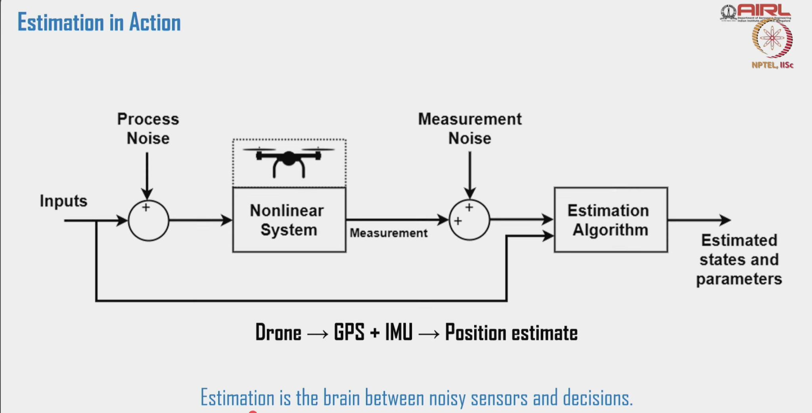

# Drone Sensors

> Source: NPTEL — Drone Systems and Control (IISc), Lec 08

---

## IMU — Inertial Measurement Unit

Combines accelerometer + gyroscope (and optionally magnetometer) into a single package.

| Type | Notes |
|------|-------|
| Mechanical | Large, high accuracy — not suitable for small UAVs |
| Optical | Laser/fibre-optic based — high precision, expensive |
| **MEMS** | Micro Electro-Mechanical Systems — standard for UAVs |

**Why MEMS:** Low cost · Lightweight · Power efficient

---

## MEMS Accelerometer

Measures **linear acceleration** along X, Y, Z axes; also measures gravity direction (useful for tilt sensing).

**Working principle:** Tiny proof mass inside shifts under acceleration → changes capacitance between fixed and movable plates → converted to acceleration value.

| Detects | Used for |
|---------|----------|
| Linear motion (forward/back, left/right, up/down) | Velocity & position estimation |
| Gravitational acceleration (static) | Tilt / orientation (with gyroscope) |
| Sudden deceleration | Free-fall or collision detection |
| Thrust changes | Flight control feedback |

---

## MEMS Gyroscope

Measures **angular velocity** (rate of rotation) around roll (X), pitch (Y), yaw (Z).

**Working principle:** Vibrating mass shifts due to Coriolis effect under angular motion → shift converted to electrical signal proportional to angular velocity.

| Function | Role |
|----------|------|
| Attitude estimation | Tracks orientation over time by integrating angular rate |
| Flight stabilisation | Feeds PID loop to correct unwanted rotations |
| Angular rate control | Direct rate damping |
| Orientation tracking | Maintains heading during dynamic manoeuvres |

> **Gyroscope drift:** Integrating angular rate accumulates error over time. Must be corrected by fusing with accelerometer (gravity reference) and magnetometer (heading reference).

---

## Magnetometer

Measures the intensity and direction of Earth's magnetic field along 3 axes (X, Y, Z).

**Working principle:** Hall-effect or magneto-resistive technology.

**Primary use:** Provides **absolute yaw (heading)** relative to magnetic North — the one thing neither accelerometer nor gyroscope can give independently.

| Function | Detail |
|----------|--------|
| Heading / yaw reference | Critical when GNSS is unavailable |
| Gyroscope drift correction | Fused with gyro to correct yaw drift |
| Part of AHRS | Combined with accel + gyro in Attitude & Heading Reference System |
| Return-to-home / path planning | Requires known heading |

---

## Sensor Fusion Summary

No single sensor is sufficient alone:

| Sensor | Gives | Weakness |
|--------|-------|----------|
| Accelerometer | Tilt (roll/pitch) from gravity | Noisy under vibration; can't give yaw |
| Gyroscope | Rate of rotation (all 3 axes) | Drifts over time |
| Magnetometer | Absolute yaw/heading | Disturbed by magnetic interference (motors, PCB traces) |

→ All three are **fused** (e.g. Kalman filter / Mahony / Madgwick) to get stable roll, pitch, yaw estimates.

---

## AIO PCB Design Implications

- **Accel + gyro** are usually one chip (e.g. ICM-42688-P, MPU-6000) — place close to CoM, isolated from vibration
- **Magnetometer** (e.g. QMC5883L, IST8310) must be placed **away from power traces, motor drivers, and inductors** — magnetic interference corrupts heading
- Consider a **separate mag breakout** or mount it on a mast if the ESC stage is on the same board
- Dual IMU (two accel/gyro chips) for redundancy is standard practice on flight-critical boards

---

## 3D LiDAR

Emits laser pulses and measures return time to build precise 3D point clouds of the environment.

| Advantages | Limitations |
|------------|-------------|
| High accuracy 3D maps | Expensive |
| Long range (vs ultrasonic/camera) | High power → reduces flight time |
| Works day/night, fog, dust | Large/heavy — integration challenge |
| Ideal for SLAM | Degrades on transparent/reflective/dark surfaces |

**SLAM (Simultaneous Localisation and Mapping):** The drone builds a map of unknown surroundings while simultaneously tracking its own position within that map — LiDAR is the primary sensor for this because of its range and accuracy.

---

## RADAR

Uses radio waves to detect presence, distance, speed, and orientation of objects. Works in fog, smoke, rain, darkness — conditions that defeat LiDAR and cameras.

**Working principle:**
1. Emits radio wave toward target
2. Receives reflected echo
3. Distance = (time delay × speed of light) / 2
4. Velocity = measured via **Doppler shift** (see below)

### Doppler Shift — Explained

When a wave source and observer move relative to each other, the received frequency differs from the emitted frequency. This frequency shift is the **Doppler effect**.

```
Δf = 2 × f₀ × v / c

where:
  f₀ = transmitted frequency
  v  = relative velocity between radar and target
  c  = speed of light
  Δf = Doppler frequency shift
```

- Target **moving toward** radar → reflected wave compressed → **higher** frequency received (Δf > 0)
- Target **moving away** → reflected wave stretched → **lower** frequency received (Δf < 0)
- **Stationary target** → no shift (Δf = 0)

In drone context: the RADAR measures Δf of the echo, computes `v = Δf × c / (2 × f₀)` to get the drone's velocity relative to the ground (or an obstacle). This is used for **velocity estimation independent of GPS** — critical during GPS outage or in tunnels/indoor spaces.

### RADAR Types Used in Drones

| Type | How | Use |
|------|-----|-----|
| **FMCW** (Frequency Modulated Continuous Wave) | Continuously sweeps frequency; range from beat frequency, velocity from Doppler | Most common in drones & automotive |
| **Pulse RADAR** | Sends discrete pulses; measures return time | Less common in small UAVs (needs large antenna) |
| **Millimetre-Wave** (24 GHz / 77 GHz) | Very short wavelength → compact, high accuracy | Preferred for small UAV integration |

**Key features vs other sensors:**

| | LiDAR | RADAR | Ultrasonic | Camera |
|-|-------|-------|-----------|--------|
| Works in fog/smoke | Yes | Yes | Partial | No |
| Night operation | Yes | Yes | Yes | No |
| Velocity direct measurement | No | **Yes (Doppler)** | No | No |
| Resolution | High | Low | Very low | High |
| Cost | High | Medium | Low | Low |

---

## Visual Sensors — Cameras

### Stereo Camera

Two RGB cameras at a fixed, known separation — mimics human binocular vision to compute depth.

**How:** Captures two simultaneous images from slightly different perspectives → triangulates the pixel disparity between them → depth per pixel.

| Applications | Limitations |
|-------------|-------------|
| 3D mapping | Sensitive to calibration errors |
| Depth estimation | Lower accuracy at long distances |
| Visual odometry & obstacle avoidance | Degrades in poor/changing lighting |

Example chip: **ZED M** (StereoLabs) — common in research UAVs.

---

## Drone Applications → Sensor Mapping

> Source: NPTEL Lec 09, Slide 37

| Application | Primary Sensors | Purpose |
|-------------|----------------|---------|
| **Navigation & Waypoint Control** | GNSS, IMU | Position hold, route following, heading correction |
| **Altitude Hold** | Barometer, Ultrasonic, LiDAR | Stable hover at specific height — indoor and outdoor |
| **Obstacle Avoidance** | 3D LiDAR, Camera, Ultrasonic, LiDAR Altimeter | Avoid collisions during autonomous flight |
| **Indoor Navigation** | 3D LiDAR, Camera, Optical Flow, IMU | SLAM, vision-based odometry in GPS-denied environments |
| **Autonomous Landing** | Downward Camera, Ultrasonic, LiDAR Altimeter | Visual target detection, precision landing, terrain detection |
| **Search & Rescue** | Thermal Camera, GNSS, RGB Camera | Human detection, geotagging images, mission planning |
| **Surveillance & Mapping** | RGB Camera, LiDAR, GNSS, Thermal Camera | Aerial photography, orthomosaics, 3D mapping |
| **Precision Agriculture** | Multispectral Camera, GNSS | Crop health monitoring, NDVI index, altitude-based spraying |
| **Delivery Drones** | GNSS, IMU, Obstacle Sensors | Safe path planning, location tracking, drop-point accuracy |

---

---

## Why Estimation? (Lec 11)

**Sensors ≠ State.** Raw sensor output is noisy, delayed, and incomplete:
- IMU → biased, drifty
- GPS → jittery, slow
- Barometer → temperature-sensitive

**Estimation bridges sensing and control:**
```
Sensors → [Estimation] → Control
```
> "You can't control what you can't reliably estimate."

Estimation combines multiple sensor inputs to infer the **true state** — position, velocity, attitude, and even unobservable quantities like wind speed. Without it: raw data → unstable, oscillatory flight. With it: smooth, accurate control.

Critical for: sensor fusion (IMU + GPS + camera), localisation, precision landing, GPS-denied navigation.

### Estimation in Action — Block Diagram


*Source: NPTEL Lec 11 — Drone Systems and Control, IISc*

**Reading the diagram:**

| Block | What it is |
|-------|-----------|
| **Inputs** | Control commands sent to the drone (e.g. servo positions, throttle) |
| **Process Noise** | Unmodelled disturbances — wind, vibration, model error — that corrupt the actual system behaviour |
| **Nonlinear System** | The drone itself — physics of rotor, swash plate, aerodynamics |
| **Measurement** | Raw sensor output (GPS position, IMU acceleration, etc.) |
| **Measurement Noise** | Sensor errors — quantisation, bias, drift |
| **Estimation Algorithm** | Kalman filter / EKF / UKF — fuses inputs + measurements to produce best state estimate |
| **Estimated states** | Clean position, velocity, attitude handed to the PID controller |

**Key insight:** The estimation algorithm receives both the control inputs (what we *told* the drone to do) and the noisy measurements (what the sensors *say* happened), then reconciles them into a reliable state estimate.

`Drone → GPS + IMU → Position estimate` — this is the simplest real-world instance of this diagram.

### Types of Estimation Problems

| Type | Estimates | Examples | Methods |
|------|-----------|----------|---------|
| **Parameter (Static)** | Fixed, unknown quantities | Sensor bias/gain, mass of object | MLE, Bayesian estimation |
| **State (Dynamic)** | Quantities that evolve over time | Position, velocity, attitude of drone | Kalman Filter, EKF, Particle Filter |

State estimation requires **recursive updating** — each new sensor measurement refines the estimate. This is what the Kalman Filter does on your AIO FC board every IMU cycle.

---

## Sources
- NPTEL: Drone Systems and Control, IISc Bangalore — Lec 08 (Slides 6, 8, 10, 12); Lec 09 (Slides 23, 25, 28, 37); Lec 11 (Slides 3, block diagram)
