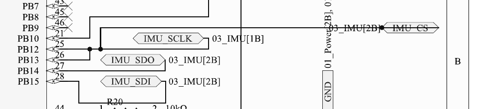

# AIO Flight Controller — Design Review (Datasheet Thresholds vs Schematic)

**Date:** 16 July 2026

Before sending this board out, I sat down and read every datasheet in `Datasheets/` at the threshold level — absolute maximum ratings, recommended operating conditions, and the electrical characteristics tables — and then traced the schematic (`schematic_Design/Schematic_diagram.pdf`, 11 pages) pin by pin against them. This document is what I found. For every issue I've added a snippet from the schematic so you can see exactly where the problem is on the sheet.

Datasheets I worked from:

| Part | Document | File |
|---|---|---|
| MPM3610GQV (3.3V buck) | MPS datasheet Rev 1.01 | `MPM.pdf` |
| FD6288/FD6288Q (gate driver) | Fortior preliminary datasheet | `GATEDRIVER.pdf` |
| AON7524 (MOSFET) | Alpha & Omega Rev 1.0, Mar 2013 | `MOSFETdatasheet.pdf` |
| ICM-42688-P (IMU) | TDK DS-000347 Rev 1.2 | see note below |
| SX1280/SX1281 (RF) | Semtech Rev 2.2, May 2018 | `RFTRANSRECIEVER.pdf` |
| W25Q128JV (flash) | Winbond Rev F, Mar 2018 | `FLASHMEMORY.pdf` |
| STM32F411xC/xE (FC MCU) | ST DocID026289 Rev 7 | `STM32.pdf` |
| STM32G071x8/xB (ESC MCU) | ST DS12232 | `ESC_MCU.pdf` |

One housekeeping note before anything else: the `ICM.pdf` in the folder is only the 1-page product brief (PB-000072), not the actual datasheet. I pulled the full DS-000347 separately for this review — we should replace the file in the repo. Also `ESC_MCU.pdf` and `STM32G071GBU6..pdf` are byte-identical duplicates, one can go.

---

## A. Critical issues — these will damage hardware or the board simply won't work

### A1. SX1280 is powered from VBAT — it will die at power-on

The SX1280's absolute maximum on VBAT and VBAT_IO is **3.9 V** (Table 3-1), and its operating range is 1.8–3.7 V (Table 3-2). But on sheet 7, VR_PA, VBAT_IO and VDD_IN of U4 are all fed from the **VBAT** port — the same net that feeds the gate drivers, i.e. the raw battery.

Since the rest of the design can't actually run below 2S (see A3), VBAT is 7.4–8.4 V. That's roughly **twice the radio's absolute maximum**. Even on 1S a fresh cell at 4.2 V is already over the limit. The radio is dead the moment we plug in a battery.

**Fix:** move all SX1280 supply pins to the 3.3 V rail. (Operating max is 3.7 V so that's fine — though see B1, our "3.3 V" rail is actually 3.45 V right now.)

### A2. The gate drivers have no power — the `5V` net doesn't exist anywhere

On sheets 10 and 11, the FD6288Q VCC pin (pin 4) on both U6 and U7, plus the three BAT54 bootstrap feeds, sit on a net labelled `5V`. Look at the cross-reference list on that net: it only points to `gatedriver1[3B], gatedriver2[2A], gatedriver2[3B]`. In other words, the net exists **only on the gate driver sheets**. Nothing generates it. The only regulator on the board is the MPM3610 making 3.3 V (sheet 2), and USB VBUS is its own isolated `USB_5V` net on sheet 6.

Three consequences:

1. The gate drivers never power up, so no motor can ever spin.
2. It's also an abs-max violation: the FD6288 logic inputs (HIN/LIN) are rated −0.3 V to VCC + 0.3 V. With VCC = 0 V, the first 3.3 V PWM edge from the G071 is ~3 V over the input limit.
3. Even if we did route a real 5 V rail here, it would be marginal: the FD6288 VCC UVLO rising threshold is 4.2/4.6/**5.0** V (min/typ/max). A worst-case part never turns on from a 5.0 V nominal rail. Fortior's recommended VCC range is 5–20 V.

**Fix:** feed FD6288 VCC directly from VBAT (2S = 7.4–8.4 V). VCC abs-max is 25 V, recommended max 20 V, so we're safe up to 4S. The AON7524 gates then see ~8.4 V, well inside the ±12 V VGS limit, and RDS(on) is actually better than at the 4.5 V spec point.

### A3. 1S operation is impossible — this is a 2S–4S design, full stop

- MPM3610 recommended VIN is **4.5–21 V**, with UVLO rising at 3.65/3.9/4.15 V and ~650 mV hysteresis. A 1S pack (3.0–4.2 V) spends its whole discharge curve below or inside the UVLO band.
- The FD6288 UVLO issue above means 1S can never enable the gate drivers either.
- Upper end: 4S (16.8 V) is fine against the MPM3610's 21 V max. 5S (21.0 V) has literally zero margin, 6S violates.

Our presentation contradicts itself here — slide 4 says "VBAT 3.0–4.2 V → 3.3 V" (1S) while slide 26 assumes 2S. Only 2S–4S is electrically valid; the slides need fixing.

### A4. MPM3610 EN pin is tied straight to VIN — abs-max violation on 2S

The MPM3610 abs-max table puts EN (under "all other pins") at **−0.3 to +6 V**. The Enable Control section (Fig. 4) explains there's an internal ~6.5 V zener, and for VIN > 6 V you must connect EN through a resistor sized to keep the zener current under 100 µA. On sheet 2, EN (pin 17) is wired directly to IN (pin 16), which is VBAT — so at 2S the EN pin sees 8.4 V with no current limiting at all.

**Fix:** at least 20 kΩ between VBAT and EN for 2S; ≥ 103 kΩ if we want 4S. (Formula from the datasheet: R ≥ (VIN − 6.5 V)/100 µA.)

### A5. USB is wired to the wrong pins

On the STM32F411, USB OTG FS lives on **PA11/PA12 only** — the DM/DP functions don't exist anywhere else. On sheet 3, USB_DN goes to **PA1** and USB_DP to **PA2**, and PA11/PA12 are left unconnected. USB will never enumerate, which also kills the Configurator connection and DFU-over-USB.

### A6. IMU SPI is broken — PB12 and PB13 are shorted together

I traced this twice because I didn't believe it the first time. On sheet 3 there's a junction dot joining PB12 and PB13, and the merged net carries both the **IMU_CS** and **IMU_SCLK** labels. So chip-select and SPI clock are the same wire.

SPI2 to the ICM-42688-P cannot work like this — CS is a level input (VIH ≥ 0.7·VDDIO per DS-000347 Table 4), it can't double as a clock.

### A7. There is no signal path between the flight controller and the ESCs

This is the big one. The only nets shared between the F411 and the two G071s are **3.3V and GND**. No throttle, no PWM, no DShot, no UART, no telemetry — nothing. On the F411 side every candidate output (PA0, PA8–PA12, PA15, PB2–PB4, PB6–PB9) is no-connect. On the G071 side the only signal pins connected are the six PWM outputs going to the gate drivers.

As drawn, the motors are uncontrollable by design. We need to route throttle-signal nets (and ideally telemetry back) from the F411 to each G071.

### A8. ESC SWD clock is miswired — we can't even flash the G071s

SWCLK on the STM32G071 is **PA14**. On sheets 8 and 9 (both ESCs), the SWCLK/SWCLK2 wire pads route to **PC14-OSC32_IN** instead, and PA14-BOOT0 is no-connect. SWD will never connect, so neither ESC MCU can be programmed.

One thing that is *not* a bug here: leaving PA14-BOOT0 floating is fine on the G071 — factory option bytes default nBOOT_SEL = 1, so the pin is ignored and a blank chip boots the system bootloader via the empty-check (RM0444 §3.5).

### A9. VCAP capacitor on the F411 is undersized

STM32F411 Table 16: packages with a **single VCAP pin need 4.7 µF** (ESR < 1 Ω). The 2×2.2 µF option only applies to dual-VCAP packages, and our UFQFPN48 has one VCAP pin. On sheet 3, C32 on VCAP1 is 2.2 µF — half of what's required. That puts the internal core regulator (1.26–1.38 V at Scale 1) out of its stability spec, which is the kind of thing that shows up as random hard faults at 100 MHz.

**Fix:** change C32 to 4.7 µF. One-line change.

---

## B. Wrong values / marginal — it might work, but only by luck

### B1. Our "3.3 V" rail is actually 3.45 V

The MPM3610 reference is VFB = 0.798 V, and the datasheet's recommended divider for 3.3 V is 102 kΩ / 32.4 kΩ (Table 1). We used R4 = 100 kΩ and R5 = 30.1 kΩ (visible in the A4 snippet above), which gives **VOUT = 3.449 V typical**, 3.380–3.519 V worst case over tolerance and temperature.

Everything on this rail has an operating max of 3.6 V — the F411, the G071s, the ICM-42688-P, the W25Q128JV. So worst case we're left with **81 mV of headroom** on every digital part on the board. Nothing is violated yet, but all the margin is gone before we've even accounted for load transients.

**Fix:** swap the divider to the datasheet's 102k/32.4k.

### B2. Crystal load caps are a bit off

The ABLS-8.000MHZ-B2-T is an 18 pF-CL crystal. With C6 = C7 = 18 pF, the effective load is 18/2 + ~5 pF stray ≈ 14 pF vs the required 18 pF. The oscillator will run a few tens of ppm fast with reduced margin. Not fatal, but it's a two-component fix: use ~30 pF caps, or switch to a 9–10 pF CL crystal.

### B3. The ESC MCUs are completely sensor-blind

Every ADC-capable pin on both G071s (PA2–PA7, PB0, PB1) is no-connect. I checked whether R24–R35 (the 100 kΩ resistors on the gate driver sheets) might be sense dividers — they're not, they're gate-source pull-down bleeders (gate→phase for the high side, gate→GND for the low side), and no resistor midpoint routes to any MCU pin. There's also no current-sense shunt anywhere; the low-side sources go straight to ground.

Sensorless six-step control (per the ST app notes we referenced, or AM32) needs BEMF/phase-voltage dividers into the comparators or ADC, and current sense for protection. The G071 has exactly the right peripherals for this — 2.5 Msps ADC, internal comparators, TIM1 — but nothing is wired to them. The A7 snippet above shows this too: look at PA2–PA7/PB0 along the bottom, all crossed out.

### B4. IMU interrupt isn't connected

INT1/INT (pin 4) of the ICM-42688-P is no-connect, and INT2/FSYNC is tied to ground. Flight firmware synchronizes the PID loop to the gyro data-ready interrupt over EXTI — without INT1 we're stuck polling the gyro with jitter. Route INT1 to any free EXTI-capable pin on the F411 (PA8 is free).

### B5. Two SPI clocks sharing one data pair

On sheet 3, FLASH_CLK is on PA4 and SX_SCK is on PA5, while MISO and MOSI are shared between both devices (PA6 = FLASH_IO1 + SX_MISO, PA7 = FLASH_IO0 + SX_MOSI). That's not a standard shared SPI bus — a shared bus is one clock and multiple chip-selects. This topology only works if firmware carefully manages two clock pins and never overlaps transactions, which no standard SPI driver does. It also permanently caps the flash at dual-IO.

For reference, the clock ceilings: SX1280 SPI maxes at 18 MHz, ICM-42688-P at 24 MHz, W25Q128JV at 133 MHz (50 MHz for the 03h read).

### B6. Don't trust the AON7524's headline current rating

The 25 A (TA = 25 °C) rating and the RθJA of 60/75 °C/W assume **1 in² of 2 oz copper per device in still air** (note A in the datasheet). Six DFN3×3 FETs on a 25×25 mm board are not each getting a square inch of copper. In practice this is fine for us — a nano-UAV motor draws single-digit amps, and at 5 A the conduction loss is under 100 mW per FET with RDS(on) ≤ 4 mΩ. Just don't size anything based on the headline 28 A number.

---

## C. Things I checked that are actually fine

| Interface | Requirement (datasheet) | Our design | Verdict |
|---|---|---|---|
| G071 PWM → FD6288 logic | VIH ≥ 2.7 V ("3.3/5 V compatible") | G071 VOH ≥ VDD−0.4 = 2.9 V; inputs are 200 kΩ pull-down so VOH ≈ VDD | OK, ~0.6 V margin |
| FD6288 dead time | internal 100/200/300 ns + shoot-through protection | complementary HIN/LIN from TIM1 | OK |
| FD6288 drive strength vs FET gate | ±1.5/1.8 A source/sink | AON7524 Qg = 16 nC @4.5 V, Rg = 3 Ω typ | OK, fast and clean |
| AON7524 VDS | 30 V abs-max (36 V 100 ns spike) | 8.4 V bus at 2S | OK, 3.5× margin |
| AON7524 VGS | ±12 V abs-max | ≤ 8.4 V once driver is VBAT-fed | OK |
| Body diode | VSD ≤ 1 V, trr 16 ns | six-step commutation | OK |
| 3.3 V logic levels FC ↔ flash/IMU/SX1280 | all 0.7/0.3·VDD class | same rail | OK |
| BOOT0 strap (F411) | VIL ≤ 0.43 V | 10 kΩ to GND | OK electrically (but see Rotorflight notes) |
| NRST buttons + 10 kΩ pull-ups | internal 30–50 kΩ RPU, ≥300 ns pulse | TL3342 buttons | OK |
| Reset/SWD pads (F411) | PA13/PA14 + GND + 3V3 | present | OK |
| MPM3610 load | 1.2 A continuous, 2.4 A min current limit | total digital load ≈ 0.15–0.3 A | OK, big margin |
| USB-C CC pulldowns | 5.1 kΩ Rd (UFP) | R10/R11 = 5.1 kΩ | OK |

---

## D. Can Rotorflight actually run on this board?

Short answer: **not as designed** — and some of the blockers are not fixable with schematic tweaks alone.

**Firmware-side blockers:**

- **The F411 is EOL in Rotorflight.** The rotorflight-firmware README says it directly: "support for lesser MCUs like STM32G474 and STM32F411 is EOL and will be removed soon." Building a new board around the F411 in 2026 means building for a dead target. We should seriously consider an F722/H743-class MCU for Rev B.
- **SPI ExpressLRS is compiled out of Rotorflight 2.** In `src/main/target/STM32_UNIFIED/target.h` both `USE_RX_EXPRESSLRS` and `USE_RX_SX1280` are `#undef`'d. So even if we fix the SX1280 power problem (A1) and the shared-bus mess (B5), Rotorflight will not talk to an SPI-connected SX1280. The supported path is a serial ELRS receiver on a UART.

**Hardware requirements from the Rotorflight FC design spec (rotorflight-ref-design/FC-Design-Requirements.md) that we're missing:**

- A **DFU button** — our BOOT0 is hard-strapped low through 10 kΩ with no button, so DFU mode is unreachable without SWD gear.
- **Two indicator LEDs** — none on the board.
- A **barometer** (SPL06/DPS310 class) — none on the board.
- **Blackbox flash ≥ 1 Gbit** — Rotorflight lists the W25Q128 as "supported but not large enough"; the recommendation is W25N01G.
- A **5 V ≥ 1 A rail** for servos/peripherals — we have none (see A2; the phantom `5V` net makes this doubly relevant. If we add a real 5 V buck for Rotorflight, the gate driver problem gets a second possible solution too).
- **ADC voltage sensing** of Vx and +5 V — no ADC sensing anywhere on the FC either.
- **Servo headers** with the correct timer allocation, and a **serial receiver UART** broken out.

So the Rotorflight to-do list is: MCU upgrade (F411 → F7/H7), drop SPI-SX1280 in favour of a serial ELRS module on a UART, add BOOT0 button + LEDs + baro + bigger flash + 5 V rail + battery/5 V ADC sensing + servo/UART headers.

---

## E. Consolidated fix list for Rev B

1. SX1280 supplies → 3.3 V rail, never VBAT (A1) — but see D: SPI SX1280 is dead in RF2 anyway, plan for serial ELRS.
2. FD6288 VCC → VBAT; delete the phantom `5V` net or add a real 5 V buck (A2). A 5 V ≥ 1 A buck is required for Rotorflight servos anyway, so probably add it.
3. Spec the battery as 2S–4S everywhere; fix slide 4 of the presentation (A3).
4. ≥ 20 kΩ between VBAT and MPM3610 EN (A4).
5. USB_DN/DP → PA11/PA12 (A5).
6. Separate IMU_CS (PB12) and IMU_SCLK (PB13) (A6).
7. Add throttle + telemetry nets from the FC to each G071 (A7).
8. ESC SWCLK → PA14 on both ESCs (A8).
9. VCAP C32 → 4.7 µF (A9).
10. Feedback divider → 102k/32.4k for a true 3.3 V rail (B1).
11. Crystal caps → ~30 pF, or a 9 pF-CL crystal (B2).
12. BEMF dividers + low-side current shunts into the G071 ADC/COMP pins (B3).
13. IMU INT1 → an EXTI pin on the FC, e.g. PA8 (B4).
14. Give each SPI device a proper bus — one clock, separate chip selects (B5).
15. Rotorflight items (D): MCU to F7/H7 class, serial ELRS on a UART, BOOT0 button, 2 LEDs, barometer, ≥1 Gbit flash, 5 V ≥ 1 A rail, ADC battery/5 V sensing, servo + UART headers.
16. Repo hygiene: replace `ICM.pdf` (product brief) with the full DS-000347, delete the duplicate `STM32G071GBU6..pdf`.
