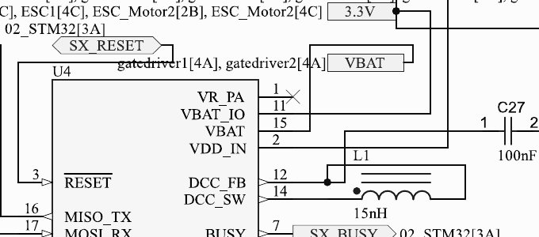
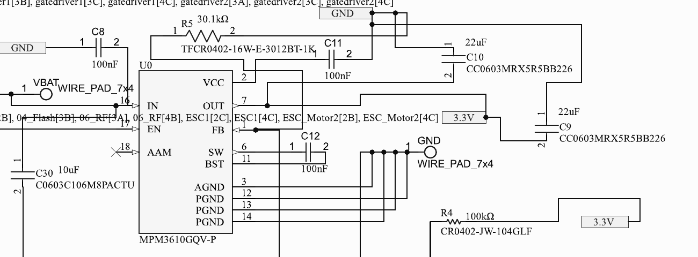
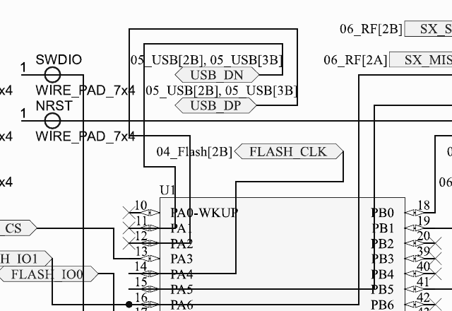
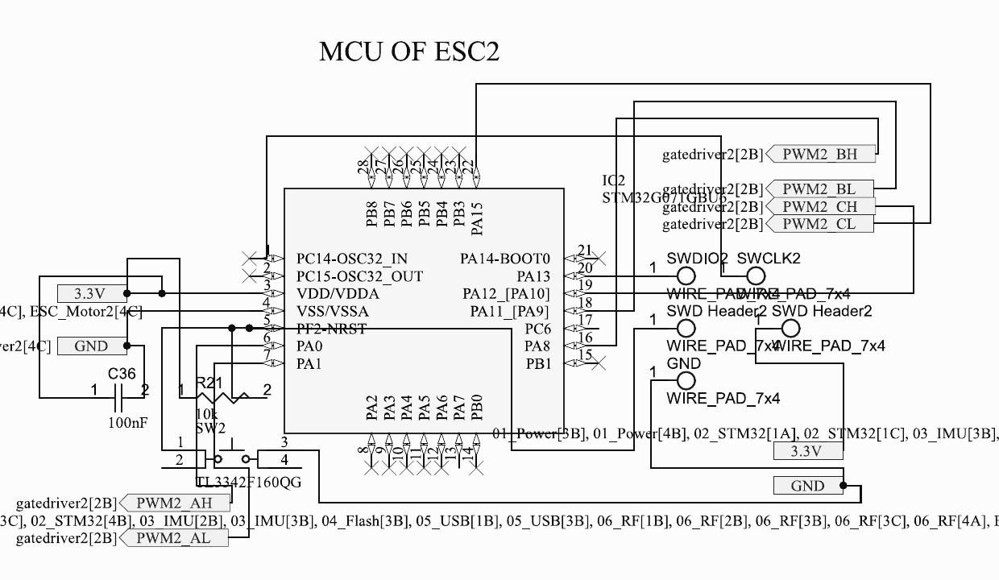
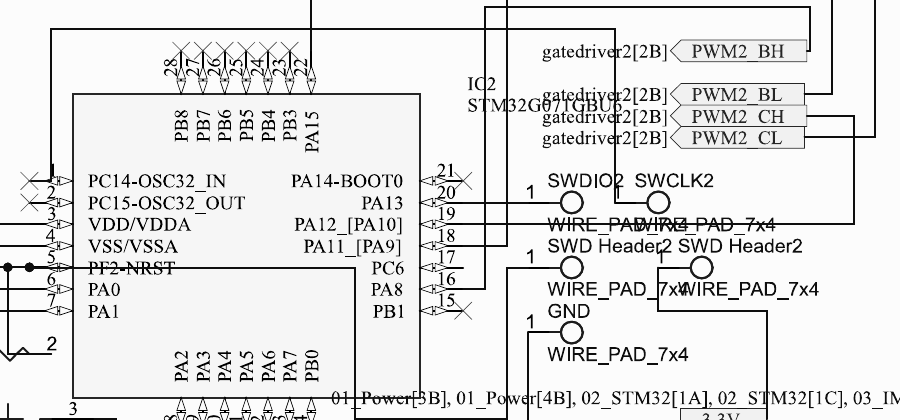
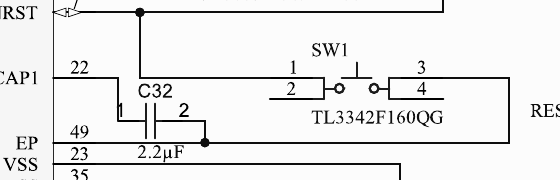
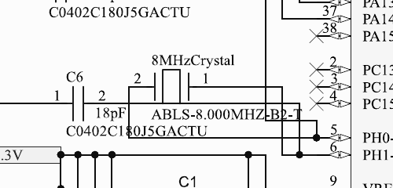
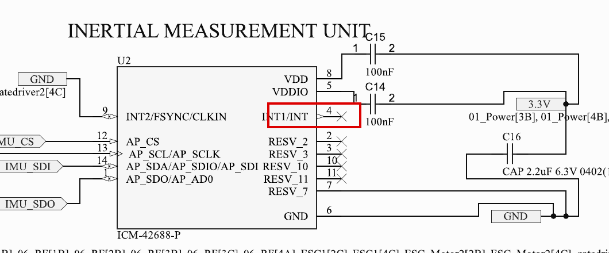
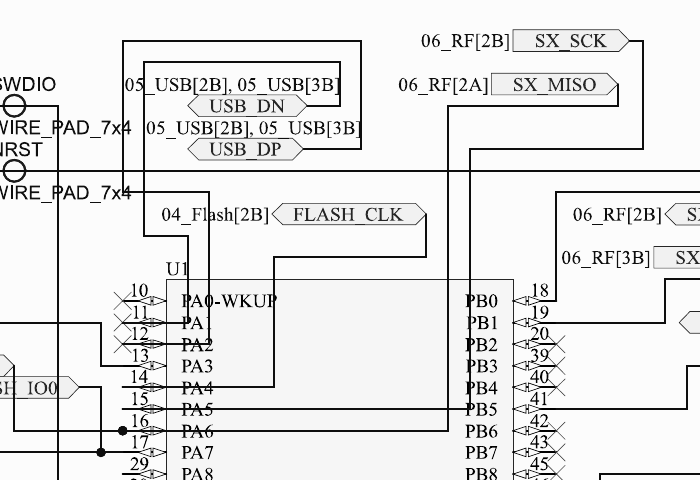

# AIO Flight Controller — Design Review (Datasheet Thresholds vs Schematic)

Terms used:

- **Absolute maximum rating (abs-max):** the voltage/current beyond which the chip can be *permanently damaged*. It is not an operating point — you're not allowed to touch it even for a moment.
- **UVLO (under-voltage lockout):** a built-in safety that keeps a chip switched OFF until its supply rises above a threshold. Below that voltage the chip simply refuses to start, so a supply that never crosses the UVLO threshold means the chip never turns on at all.

## Components and datasheets

Every major part on the board, what it is, and the datasheet reviewed against:

| Part code | What it is | Its job on this board | Datasheet / file |
|---|---|---|---|
| **STM32F411CEU6** | MCU (ST) | The flight controller — runs the flight firmware: gyro, PID loop, motor commands, PC link | ST DocID026289 Rev 7, `STM32.pdf` |
| **STM32G071GBU6** | MCU (ST) | The ESC brain — one per motor; generates the six timed PWM signals that commutate a brushless motor | ST DS12232, `ESC_MCU.pdf` |
| **MPM3610GQV-P** | Synchronous step-down (buck) DC-DC converter *module* (MPS) — regulator with the inductor built into the package; 21 V in, 1.2 A out | Converts battery voltage to the 3.3 V rail that powers every digital chip | MPS Rev 1.01, `MPM.pdf` |
| **ICM-42688-P** | 6-axis MEMS inertial measurement unit (TDK) — 3-axis gyroscope + 3-axis accelerometer on SPI | The flight sensor: measures rotation rate and acceleration thousands of times a second; the input to the PID loop | TDK DS-000347 Rev 1.2, see note below |
| **SX1280IMLTRT** | 2.4 GHz radio transceiver IC (Semtech) — the LoRa/FLRC chip that ExpressLRS control links are built on | Meant to receive the pilot's stick commands over the air, on-board (SPI-ELRS style) | Semtech Rev 2.2 May 2018, `RFTRANSRECIEVER.pdf` |
| **W25Q128JVSIQ** | 128 Mbit (16 MB) serial NOR flash memory (Winbond), SPI | Blackbox storage — records flight logs for tuning | Winbond Rev F Mar 2018, `FLASHMEMORY.pdf` |
| **FD6288Q** | Three-phase half-bridge gate driver IC (Fortior) — level-shifts and amplifies six logic PWM inputs into MOSFET gate drive, with built-in dead-time protection | The interface between each ESC MCU's 3.3 V signals and the power MOSFETs | Fortior preliminary, `GATEDRIVER.pdf` |
| **AON7524** | N-channel power MOSFET (Alpha & Omega) — 30 V, ~4 mΩ, DFN3×3 package | The power switches — six per motor arranged as a three-phase bridge; they carry the actual motor current | AOS Rev 1.0 Mar 2013, `MOSFETdatasheet.pdf` |
| **BAT54** | Small-signal Schottky diode — 30 V, 200 mA | Bootstrap diodes in the gate driver circuit — charge the flying capacitors that power the high-side gate drive | — |
| **ABLS-8.000MHZ-B2-T** | 8 MHz quartz crystal (Abracon), 18 pF load | Clock reference for the F411, multiplied on-chip to 100 MHz | — |
| **ECS-520-8-47-CKM** | 52 MHz quartz crystal (ECS) | Frequency reference for the SX1280 — its 2.4 GHz carrier is synthesized from this | — |
| **TL3342F160QG** | Miniature tactile push-button switch (E-Switch) | Reset buttons for the three MCUs | — |
| **EEE-FK1E101P** | 100 µF 25 V aluminium electrolytic capacitor (Panasonic) | Bulk capacitor on the battery rail beside each MOSFET bridge — supplies the motor's big current pulses | — |
| **530470310** | 3-pin Molex PicoBlade connector | Motor connectors — each motor's three phase wires plug in here | — |

One housekeeping note before anything else: the `ICM.pdf` in the folder is only the 1-page product brief (PB-000072), not the actual datasheet. I pulled the full DS-000347 separately for this review — we should replace the file in the repo.

---

## A. Critical issues — these might damage hardware or the board might not work

### A1. SX1280 is powered from VBAT — it will die at power-on

**The problem in one line:** the radio chip is a 3.3 V-class part, and we've connected it straight to the battery.

The SX1280 (Semtech's 2.4 GHz radio transceiver — the chip that ExpressLRS control links are built on) has an absolute maximum on its supply pins (VBAT / VBAT_IO) of **3.9 V**, and its normal operating range is 1.8–3.7 V. On sheet 7, though, VR_PA, VBAT_IO and VDD_IN of U4 are all fed from the **VBAT** port — the same raw-battery net that feeds the gate drivers. (Confusing naming: the *pin* on the SX1280 is called VBAT, but it expects ~3.3 V, not battery voltage. That's probably exactly how this mistake happened.)

Since the rest of the design can't actually run below 2S (see A3), the battery net sits at 7.4–8.4 V — roughly **twice what the radio can survive**. Even a single fresh cell at 4.2 V is already over the 3.9 V limit. The radio dies the moment a battery is plugged in.

**Fix:** move all SX1280 supply pins to the 3.3 V rail. (Its operating max is 3.7 V so 3.3 V is comfortable — though see B1, our "3.3 V" rail is actually 3.45 V right now.)

### A2. The gate drivers have no power — the `5V` net doesn't exist anywhere

Quick background: a MOSFET needs several volts on its gate to switch on, and the MCU's 3.3 V logic can't drive that directly — that's the gate driver's job (here the FD6288Q, Fortior's three-phase gate driver IC). It takes the MCU's small PWM signals in and pushes strong, higher-voltage pulses out to the six MOSFETs. But to do that, the gate driver itself needs a supply.

On sheets 10 and 11, the FD6288Q VCC pin on both U6 and U7, plus the three BAT54s (small Schottky diodes forming the bootstrap circuit that powers the high-side gate drive), sit on a net labelled `5V`. Here's the catch: in a multi-sheet schematic, every net label carries a cross-reference list showing which other sheets it appears on. The `5V` net's list only points to `gatedriver1[3B], gatedriver2[2A], gatedriver2[3B]` — i.e. **only back to the gate driver sheets themselves**. No regulator, no connector, nothing anywhere on the board actually produces this 5 V. The only regulator we have is the MPM3610 (a buck converter module that steps battery voltage down) making 3.3 V (sheet 2), and USB's 5 V is a separate isolated net (`USB_5V`, sheet 6) that goes nowhere near the drivers.

Three consequences, in increasing subtlety:

1. **Nothing spins.** The gate drivers have 0 V on their supply, so they never wake up, so the MOSFETs never switch, so no motor can ever run.
2. **It damages the drivers too.** The FD6288's logic inputs are only rated up to VCC + 0.3 V. With VCC = 0 V, the very first 3.3 V PWM pulse from the ESC MCU exceeds the input rating by ~3 V. Chips generally don't tolerate signals on their inputs while unpowered.
3. **Even a real 5 V rail wouldn't be enough.** The FD6288's UVLO turn-on threshold is 4.2 V typical but up to **5.0 V worst case** — meaning an unlucky production part connected to a perfect 5.00 V rail *still* never turns on. Fortior's own recommended supply range starts at 5 V and runs to 20 V; they clearly intend this chip to run from the battery, not a logic rail.

**Fix:** feed FD6288 VCC directly from VBAT (2S = 7.4–8.4 V). Its abs-max is 25 V and recommended max is 20 V, so we're safe up to 4S. Bonus: the MOSFET gates then get driven at ~8.4 V instead of 5 V, which is well inside the ±12 V gate limit of the AON7524s (the 30 V, ~4 mΩ N-channel power MOSFETs that do the actual current switching) and actually gives *lower* on-resistance (less heat) than 5 V drive.

### A3. 1S operation is not possible — this is a 2S–4S design. (discussed in ealier meet)

Our slides claim the board runs from a single cell (1S = 3.0–4.2 V). The thresholds say otherwise, twice over:

- **The 3.3 V regulator won't start.** The MPM3610's recommended input range is **4.5–21 V**, and its UVLO turn-on is 3.65–4.15 V depending on the part. A 1S battery spends essentially its entire discharge curve at or below that threshold — so the regulator either never starts or cuts out almost immediately, taking every MCU on the board down with it.
- **The gate drivers won't start either** (the FD6288 needs up to 5 V to come out of UVLO, see A2), so even if the logic ran, the motors wouldn't.

Upper end: 4S (16.8 V max) fits comfortably under the MPM3610's 21 V limit. 5S charges to exactly 21.0 V — zero margin, so no. 6S violates outright.

### A4. MPM3610 EN pin is tied straight to VIN — abs-max violation on 2S

EN is the regulator's enable pin — pull it high and the regulator runs. The obvious shortcut is to tie EN to the input voltage so the chip is always on, and that's exactly what sheet 2 does: EN (pin 17) wired directly to IN (pin 16) = VBAT.

The catch is that EN is a *low-voltage* pin: its absolute maximum is **6 V**, even though the power input beside it takes 21 V. Inside the chip, EN is protected by a small ~6.5 V zener diode. The datasheet (Fig. 4) says that if your input is above 6 V you must connect EN through a series resistor sized to keep the current through that zener under 100 µA — the resistor takes the excess voltage so the pin doesn't have to. Tied directly, a 2S battery puts 8.4 V on a 6 V-max pin with nothing limiting the current, and the little zener slowly cooks.

**Fix:** one resistor between VBAT and EN — ≥ 20 kΩ for 2S, ≥ 103 kΩ if we want 4S. (Datasheet formula: R ≥ (VIN − 6.5 V)/100 µA.)

### A5. USB is wired to the wrong pins

On microcontrollers, most functions can be moved between pins — but not all. On the STM32F411, the USB data lines (DM/DP) exist **only on PA11 and PA12**; the USB peripheral is hard-wired to those two pins in silicon and cannot be remapped anywhere else. On sheet 3, USB_DN goes to **PA1** and USB_DP to **PA2**, and PA11/PA12 are left unconnected.

PA1/PA2 are perfectly good pins, they just have no USB hardware behind them. So the computer will never even detect the board — no Configurator connection, no firmware flashing over USB (DFU).

### A6. IMU SPI is broken — PB12 and PB13 are shorted together

I re-traced this region at 400% zoom to be certain, and the wiring is genuinely tangled. Following the wires (all visible in the snippet below):

- **PB12** (pin 25) runs right through **two junction dots**. At the first dot, a wire drops down onto **PB13** (pin 26) — that's the short.
- At the second dot, a branch climbs up to the long horizontal line whose far end carries the **IMU_CS** label.
- The far right end of the same PB12 wire hooks *upward* into the **IMU_SCLK** label's tail.

So PB12, PB13, IMU_CS and IMU_SCLK are all **one electrical net** — the chip-select line and the SPI clock line to the gyro (the ICM-42688-P — TDK's 6-axis gyro + accelerometer, the flight sensor itself) are physically the same wire, and it touches two MCU pins at once.

While verifying I also found how this mess probably happened (orange box in the snippet): **PB10** (pin 21) has a wire that routes up and across toward the same area, turns down — and stops in mid-air just above the IMU_CS line, connected to nothing. On the F411, PB10 is an alternate SPI2 clock pin. It looks like the plan was SCLK on PB10 and CS on PB12, the PB10 connection was never completed (an off-grid miss), and the leftover wiring merged into one net.

Why that can't work: on an SPI bus, chip-select (CS) has to stay *held low* for the entire transaction — it's how the sensor knows "I'm being talked to." The clock (SCLK), meanwhile, toggles up and down with every bit. One signal can't simultaneously stay still and toggle. The moment the clock starts, the sensor sees its chip-select bouncing and abandons the transaction. No gyro data, ever — which for a flight controller means no flight.

**Fix:** separate them — IMU_CS on PB12, IMU_SCLK on PB13, which is exactly what SPI2's default pinout wants anyway.

### A7. Check the signal path between the flight controller and the ESCs

Every net between the F411 (flight controller) and the two G071s (ESC MCUs), the only things they share are **3.3V and GND** — power. No throttle signal, no PWM, no DShot, no UART, no telemetry. On the F411 side, every plausible output pin (PA0, PA8–PA12, PA15, PB2–PB4, PB6–PB9) is no-connect. On the G071 side, the only signal pins connected at all are the six PWM outputs going to the gate drivers.

**Fix:** route a throttle-signal net from the F411 to each G071 (one timer-capable pin per ESC for DShot/PWM, or a UART pair if we want serial control), plus ideally a telemetry line back.

### A8. ESC SWD clock is miswired — we can't even flash the G071s

SWD is the two-wire debug/programming interface (SWDIO = data, SWCLK = clock) that we use to load firmware onto a bare STM32. Like USB in A5, these functions live on fixed pins: on the G071, SWCLK is **PA14**, full stop.

Each ESC has four programming pads next to the chip: SWDIO, SWCLK, GND and 3.3V. I traced both signal pads at high zoom (sheets 8 and 9 are identical):

- The **SWDIO pad is wired correctly** — its wire lands on PA13, which really is the G071's SWDIO pin. ✓
- The **SWCLK pad's wire goes to the wrong pin**: it leaves the pad, climbs up and over the top of the chip symbol, comes down the left side, and terminates on **PC14-OSC32_IN** (pin 1) — the input for a 32 kHz watch crystal, a pin with no debug function whatsoever.
- **PA14-BOOT0** (pin 21) — the only pin on the G071 where the SWCLK function exists — sits unconnected, marked with a no-connect cross.

What happens in practice: the programmer sends its clock pulses into a crystal pin that ignores them. The debug port never receives a clock, so the SWD handshake never even starts — the programmer just reports "no target found." And unlike the flight controller (which could at least in theory be rescued over USB), the G071s have no other way in: **blank chips stay blank, on both ESCs.**

How it probably happened: in the schematic symbol, PC14 sits directly above PA14 in the pin listing — this looks like a one-row mis-click that's invisible unless you actually follow the wire.

**Fix:** move the SWCLK pad's wire from PC14 to PA14. One wire, on each ESC sheet.

One thing that is *not* a bug here: leaving PA14-BOOT0 floating is fine on the G071. Its factory option bytes default to nBOOT_SEL = 1, meaning the BOOT0 pin is ignored, and an empty chip automatically falls into the built-in bootloader (RM0444 §3.5). So no pull resistor needed — just route SWCLK to the right pin.

### A9. VCAP capacitor on the F411 is undersized

The STM32F411's core actually runs at ~1.3 V, not 3.3 V — an on-chip regulator steps 3.3 V down internally, and the VCAP pin is where that regulator's output capacitor connects. That capacitor is part of the regulator's control loop: too small and the regulator can oscillate or sag during load spikes, which shows up as random crashes and hard faults that look exactly like firmware bugs.

The datasheet (Table 16) is explicit: packages with a **single VCAP pin need 4.7 µF** (the 2×2.2 µF option is only for packages with two VCAP pins). Our UFQFPN48 has one VCAP pin, and sheet 3 has C32 = 2.2 µF on it — half the required value.

**Fix:** change C32 to 4.7 µF. One-line change, and it removes a whole class of "unexplainable" runtime instability at 100 MHz.

---

## B. Wrong values / marginal Issues

### B1. Our "3.3 V" rail is actually 3.45 V

A buck regulator doesn't know what voltage you want — it just adjusts its output until its feedback (FB) pin sees an internal reference, here 0.798 V. You pick the output voltage with two resistors that divide the output down to that reference: VOUT = 0.798 × (1 + R_top/R_bottom). The datasheet's own table says use **102 kΩ / 32.4 kΩ for 3.3 V**.

We used R4 = 100 kΩ and R5 = 30.1 kΩ (visible in the A4 snippet). Run the numbers: 0.798 × (1 + 100/30.1) = **3.45 V typical**, and up to 3.52 V once you stack resistor tolerance and temperature drift.

Is 3.45 V dangerous? Not immediately — but every digital part on this rail (F411, both G071s, the ICM-42688-P gyro, and the W25Q128 — the Winbond 16 MB SPI flash that stores blackbox logs) has an operating maximum of **3.6 V**. Worst case, we're 81 mV from the ceiling on every chip, before accounting for any transient overshoot when the load steps. All the safety margin the designers intended is gone, spent on two wrong resistors.

**Fix:** swap the divider to the datasheet's 102k/32.4k.

### B2. Crystal load caps are a bit off

A quartz crystal is cut to oscillate at exactly its rated frequency only when it sees a specific capacitance across it — its "load capacitance," CL, printed in the datasheet. Our ABLS-8.000MHZ (an Abracon 8 MHz quartz crystal — the F411's clock reference) wants **18 pF**. The two capacitors on its pins appear *in series* from the crystal's point of view, so two 18 pF caps give 9 pF, plus roughly 5 pF of stray PCB capacitance ≈ **14 pF — 4 pF short**.

To be clear about what's *right* here: the topology is the standard Pierce oscillator and is wired correctly — the crystal sits between PH0-OSC_IN (pin 5) and PH1-OSC_OUT (pin 6), with C6 to ground on the pin-5 side and C7 to ground on the pin-6 side. Only the two capacitor *values* are off.

An underloaded crystal still oscillates, just slightly fast (a few tens of ppm) and with less stability margin. Not fatal for a flight controller, but it's a two-component fix: use ~30 pF caps (30/2 + 5 ≈ 20 pF, close enough), or switch to a 9–10 pF CL crystal.

### B3. The ESC MCUs are completely sensor-blind

Our motors are sensorless BLDCs — no position sensors inside. The standard trick ("sensorless six-step," per the ST app notes we referenced, and what AM32 does) is to *listen* to the motor itself: the un-driven third phase generates a voltage (back-EMF) as the rotor spins past, and by watching when it crosses zero, the ESC knows the rotor position and when to fire the next commutation step. That requires wiring each motor phase, through a resistor divider (phase voltages are at battery level, MCU pins are 3.3 V), into the MCU's comparators or ADC. On top of that, a practical ESC needs a current-sense shunt — a small resistor in the ground return — so it can detect overcurrent before the MOSFETs burn.

We have none of it. Every ADC-capable pin on both G071s (PA2–PA7, PB0, PB1) is no-connect. I checked whether R24–R35 (the 100 kΩ resistors on the gate driver sheets) might secretly be sense dividers — they're not; they're gate-bleed pull-downs that keep the MOSFETs off during power-up, and no resistor midpoint routes to any MCU pin. The low-side MOSFET sources go straight to ground, so there's no shunt either.

The irony is the G071 is *well* chosen for this job — 2.5 Msps ADC, built-in comparators, a motor-control timer — and every one of those peripherals is sitting disconnected. (Visible in the A7 snippet: PA2–PA7/PB0 along the bottom edge, all crossed out.)

**Fix:** three BEMF divider chains per ESC into COMP/ADC pins, plus a low-side shunt with either the internal comparator or an external amp for current limit.

**"Can't we just use the trapezoidal EMF method to figure out position?"** — Yes, and that is exactly what this section is about: "trapezoidal EMF position sensing" and "sensorless six-step / back-EMF zero-crossing" are the same technique. The distinction that matters is firmware vs hardware:

- *The method (firmware side):* in six-step drive, at any instant only two phases are energized and the third floats. Because a BLDC's back-EMF is trapezoidal, the floating phase's voltage ramps through the midpoint (half the bus voltage) exactly 30 electrical degrees before the next commutation should happen. Detect that crossing, wait 30°, switch to the next step. The G071 has every peripheral needed to run this — comparators to catch the crossing, timers to measure the delay.
- *The catch (hardware side):* the trapezoidal EMF exists **on the motor wires**, at battery-level voltage. The MCU can only watch it if there's a physical copper path from each motor phase to an MCU pin — and since the phase swings 0 V to VBAT (up to 16.8 V on 4S) while the MCU pin tolerates 3.3 V, that path must be a resistor divider, not a direct wire. There is no firmware-only workaround: software cannot observe a voltage on a node it isn't electrically connected to.

So we can and should use the trapezoidal method — but only after adding the connections. Per ESC that means three divider chains (two resistors each, e.g. ~47k over ~10k, plus a small filter cap) from each motor phase to a comparator/ADC-capable pin, and a midpoint reference for the comparator: either three more resistors forming a virtual star point (the classic AM32-style approach), half-bus through another divider, or the G071's internal DAC as the threshold. Roughly 6–9 resistors and 3 caps per ESC — cheap and small. The current-sense shunt is a separate item: it's not for position, it's protection.

One nuance: with zero sensing, a six-step motor *can* be driven open-loop — blind stepping, like a stepper motor — and that is in fact how sensorless ESCs start from standstill, since there's no back-EMF at zero RPM. But open-loop running under load is fragile and inefficient; the moment the motor has real load or needs speed changes, the zero-crossing feedback is required. The dividers are not optional for a flight-worthy ESC.

### B4. IMU interrupt isn't connected

The gyro doesn't produce data continuously — it produces a sample every N microseconds, and pulses its INT1 pin each time a fresh sample is ready. Flight firmware is built around that pulse: the PID loop literally *runs on* the gyro interrupt, so control math always executes on data that is microseconds old, with near-zero timing jitter.

On sheet 4, INT1/INT (pin 4) is no-connect (INT2/FSYNC is tied to ground, which is fine). Without INT1, the firmware falls back to polling — asking "got data yet?" on a timer — which means every sample is a variable fraction of a sample-period stale. The flight controller still flies, but the control loop is noticeably jitterier, and tuning suffers.

**Fix:** one trace from INT1 to any free EXTI-capable pin on the F411 (PA8 is free).

### B5. Two SPI clocks sharing one data pair

A shared SPI bus has a specific shape: **one** clock line, **one** MISO, **one** MOSI, and a separate chip-select per device — CS is what routes each transaction to the right chip. What sheet 3 has instead is a hybrid: the flash and the radio share MISO/MOSI (PA6, PA7), but each has its *own clock* — FLASH_CLK on PA4, SX_SCK on PA5.

That topology matches no standard SPI peripheral. The F411's SPI1 block drives one clock pin; it has no concept of "clock A for this device, clock B for that one." Making this work would mean bit-banging or constantly remuxing pins, and guaranteeing the two devices never talk at the same time — none of which any existing driver (or Rotorflight) does. It also permanently locks the flash to dual-IO mode, since two of its quad-IO pins are consumed by the sharing.

**Fix:** make it a textbook shared bus — one SCK, shared MISO/MOSI, one CS per device — or give the flash and radio separate SPI peripherals entirely. (Clock ceilings for reference: SX1280 18 MHz, ICM-42688-P 24 MHz, W25Q128JV 133 MHz.)

---

## C. Things that are checked 

| Interface | Requirement (datasheet) | Our design | Verdict |
|---|---|---|---|
| G071 PWM → FD6288 logic | VIH ≥ 2.7 V ("3.3/5 V compatible") | G071 VOH ≥ VDD−0.4 = 2.9 V; inputs are 200 kΩ pull-down so VOH ≈ VDD | OK, ~0.6 V margin |
| FD6288 dead time | internal 100/200/300 ns + shoot-through protection | complementary HIN/LIN from TIM1 | OK |
| FD6288 drive strength vs FET gate | ±1.5/1.8 A source/sink | AON7524 Qg = 16 nC @4.5 V, Rg = 3 Ω typ | OK, fast and clean |
| AON7524 VDS | 30 V abs-max (36 V 100 ns spike) | 8.4 V bus at 2S | OK, 3.5× margin |
| AON7524 VGS | ±12 V abs-max | ≤ 8.4 V once driver is VBAT-fed | OK |
| Body diode | VSD ≤ 1 V, trr 16 ns | six-step commutation | OK |
| 3.3 V logic levels FC ↔ flash/IMU/SX1280 | all 0.7/0.3·VDD class | same rail | OK |
| BOOT0 strap (F411) | VIL ≤ 0.43 V | 10 kΩ to GND | OK electrically (but see Rotorflight notes) |
| NRST buttons + 10 kΩ pull-ups | internal 30–50 kΩ RPU, ≥300 ns pulse | TL3342 buttons | OK |
| Reset/SWD pads (F411) | PA13/PA14 + GND + 3V3 | present | OK |
| MPM3610 load | 1.2 A continuous, 2.4 A min current limit | total digital load ≈ 0.15–0.3 A | OK, big margin |
| USB-C CC pulldowns | 5.1 kΩ Rd (UFP) | R10/R11 = 5.1 kΩ | OK |

---

## D. Can Rotorflight actually run on this board?

Short answer: **not as designed** — and some of the blockers are not fixable with schematic tweaks alone.

**Firmware-side blockers:**

- **The F411 is EOL in Rotorflight.** The [rotorflight-firmware README](https://github.com/rotorflight/rotorflight-firmware) says it directly: "support for lesser MCUs like STM32G474 and STM32F411 is EOL and will be removed soon." Building a new board around the F411 in 2026 means building for a target the firmware is about to drop — we'd be pinned to old releases forever. We should seriously consider an F722/H743-class MCU for Rev B.
- **SPI ExpressLRS is compiled out of Rotorflight 2.** Some flight controllers drive the radio chip directly over SPI, with the receiver protocol implemented inside the flight firmware — that's what our SX1280-on-SPI design assumes. Rotorflight 2 has removed that path: in [`src/main/target/STM32_UNIFIED/target.h`](https://github.com/rotorflight/rotorflight-firmware/blob/master/src/main/target/STM32_UNIFIED/target.h), both `USE_RX_EXPRESSLRS` and `USE_RX_SX1280` are `#undef`'d, i.e. the code is excluded at build time. So even after fixing the SX1280's power (A1) and the shared-bus mess (B5), Rotorflight simply contains no code to talk to it. The supported path is a self-contained serial ELRS receiver module wired to a UART.

**Hardware requirements from the Rotorflight FC design spec ([rotorflight-ref-design/FC-Design-Requirements.md](https://github.com/rotorflight/rotorflight-ref-design/blob/master/FC-Design-Requirements.md)) that we're missing:**

**1. A DFU button.**
Every STM32 ships from the factory with a small bootloader burned permanently into system ROM — it can't be erased or corrupted. Which program runs at power-up is chosen by the BOOT0 pin: BOOT0 low → run our firmware from flash; BOOT0 high → run the ROM bootloader, which enumerates over USB as a "DFU device" that any PC can write new firmware to. This is the safety net: if a firmware flash goes wrong and bricks the board, the user holds the button, plugs in USB, and reflashes — no special hardware needed. That's why Rotorflight makes it mandatory: their users are hobby pilots with a USB cable, not engineers with an ST-Link.

On our board (sheet 3), BOOT0 is permanently strapped low through R20 (10 kΩ) with no button. If a flash ever goes bad, the only way in is the SWD pads with a debug probe — fine for us in the lab, unacceptable for an end user.

*Rev B change:* keep the 10 kΩ pull-down (so normal boots are unaffected), add a small tactile switch from BOOT0 to 3.3 V. Pressing it during power-up wins against the pull-down and forces the bootloader. Two components, standard on every commercial FC.

**2. Two indicator LEDs.**
The firmware's only way to talk to the pilot without a laptop. Rotorflight drives them with distinct blink patterns for each state: armed/disarmed, calibration in progress, failsafe triggered, USB connected, error codes. Without them the board is a black box — you can't even tell if it powered up. We have zero LEDs anywhere (not even a power LED on the 3.3 V rail).

*Rev B change:* two GPIO-driven LEDs (any free pins) with ~1 kΩ series resistors, plus ideally a third hardwired power LED on 3.3 V. Costs three pins-worth of board space, saves hours of "is it even on?" debugging.

**3. A barometer (SPL06 / DPS310 class).**
A pressure sensor measures atmospheric pressure, which falls predictably with height — modern parts like the DPS310 resolve pressure changes corresponding to a few centimetres of altitude. The gyro/accelerometer alone can't hold altitude: integrating acceleration to get height drifts within seconds. The baro provides the absolute reference that altitude-hold and rescue/autolevel-climb functions servo against. Rotorflight is helicopter-focused where altitude hold and rescue mode are headline features, so the reference design requires one on-board.

We have nothing — page 4 is the IMU alone.

*Rev B change:* an SPL06-001 or DPS310 next to the IMU. Both are ~2 mm LGA parts, run on 3.3 V, and can share the IMU's SPI bus with their own chip-select (or sit on I²C). One chip, two caps, one CS line.

**4. Blackbox flash ≥ 1 Gbit.**
Blackbox is Rotorflight's flight recorder: every loop iteration it can log gyro, setpoint, PID terms, motor/servo outputs — the data you need to diagnose oscillations and tune the craft. At full rate this is megabytes per minute: log at ~2 kHz with ~30 fields and our 16 MB W25Q128 fills in roughly a minute of flight — barely one test hover. That's why the spec calls for ≥ 1 Gbit (128 MB) and why Rotorflight's docs list the W25Q128 as "supported but not large enough."

The recommended part, the W25N01G (1 Gbit), is the same manufacturer, same SPI interface, same SOIC-8 footprint family — but it's NAND flash rather than NOR, which is how it gets 8× the density at similar cost. Firmware already has the driver.

*Rev B change:* swap U3's part number to W25N01GVZEIG; wiring on sheet 5 barely changes.

**5. A 5 V ≥ 1 A rail.**
This is the biggest philosophical difference between a quad FC and a heli FC. On a helicopter, the FC is the power hub: cyclic/collective servos (2–4 of them), the receiver, and a GPS all run from 5 V, and servos stall-load in bursts — hence the ≥ 1 A (really, more is better) requirement with good transient behaviour. Rotorflight's spec expects the FC to source this from the battery through an on-board buck.

We have no 5 V source at all. Worse, the gate driver sheets *reference* a `5V` net that nothing generates (issue A2) — the design almost seems to assume this rail exists. That makes this fix a two-for-one: add a real 5 V buck (e.g. an MPM3610A configured for 5 V, or a TPS62933-class part for more current) and it can both feed servo/peripheral headers *and* be considered as the gate driver supply — though for the drivers specifically, VBAT-direct remains the simpler, better-margin option (see A2).

*Rev B change:* one buck module VBAT→5 V ≥ 1 A, output on servo headers + peripheral pins, with its rail also routed to an ADC divider (next item).

**6. ADC voltage sensing of the battery and the 5 V rail.**
The firmware's health monitoring. Battery voltage sensing is how Rotorflight generates low-battery warnings, triggers failsafe/rescue before the pack sags into damage territory, and compensates PID/throttle as voltage drops through the flight (a heli behaves noticeably differently at 25.2 V vs 21 V). Sensing the 5 V rail catches a different failure: servo stall or a brownout dragging the rail down — the firmware can alarm before the receiver browns out mid-flight.

The wiring is trivial — a two-resistor divider per rail scaling it into the MCU's 0–3.3 V ADC range (e.g. 10:1 for the battery: 25.2 V → 2.52 V), one small filter cap each. We have literally no ADC input connected on the FC — every analog-capable pin is either used digitally or floating.

*Rev B change:* two dividers, two caps, two ADC pins. Optionally a hall/shunt current sensor on the battery lead for current & mAh-used telemetry, which Rotorflight also supports.

**7. Servo headers with correct timer allocation, and a receiver UART.**
Two related "connector + pin-planning" items:

- *Servo headers:* a helicopter needs 3–4 standard three-pin servo connectors (signal / 5 V / GND). The subtlety is the **timer allocation** behind the signal pins. Inside an STM32, PWM pins are grouped under shared timer peripherals, and all pins on one timer share one period. Servos run at 50–333 Hz while motor ESC signals run at kHz rates — so servo pins and motor pins must come from *different* timers, and ideally each servo group sits on its own timer so refresh rates can be set independently. Rotorflight's spec spells out this grouping; it has to be designed into the pinout from the start, because it's unfixable in firmware if two conflicting outputs share a timer.
- *Receiver UART:* with SPI-ELRS gone (see above), the radio link is a separate receiver module wired to a UART — so the board needs a broken-out header with TX, RX, 5 V and GND placed where a receiver can plug in directly. A second spare UART (GPS, telemetry) is strongly recommended.

We have neither: no servo connectors anywhere, and not a single UART broken out — on sheet 3 the F411's UART-capable pins are part of the big no-connect group.

**Putting it together**, the Rotorflight to-do list for Rev B is: MCU upgrade (F411 → F722/H743 class), drop the SPI-SX1280 in favour of a serial ELRS module on a UART header, then add: BOOT0 button, two status LEDs, SPL06/DPS310 barometer, W25N01G blackbox flash, a 5 V ≥ 1 A buck feeding servo headers, battery + 5 V ADC dividers, and servo connectors with a clean timer plan. None of these is individually hard — but together they're the difference between "a board with the right chips" and "a board Rotorflight can actually fly."

---

## E. Consolidated fix list for Rev B

1. SX1280 supplies → 3.3 V rail, never VBAT (A1) — but see D: SPI SX1280 is dead in RF2 anyway, plan for serial ELRS.
2. FD6288 VCC → VBAT; delete the phantom `5V` net or add a real 5 V buck (A2). A 5 V ≥ 1 A buck is required for Rotorflight servos anyway, so probably add it.
3. Spec the battery as 2S–4S everywhere
4. ≥ 20 kΩ between VBAT and MPM3610 EN (A4).
5. USB_DN/DP → PA11/PA12 (A5).
6. Separate IMU_CS (PB12) and IMU_SCLK (PB13) (A6).
7. Add throttle + telemetry nets from the FC to each G071 (A7).
8. ESC SWCLK → PA14 on both ESCs (A8).
9. VCAP C32 → 4.7 µF (A9).
10. Feedback divider → 102k/32.4k for a true 3.3 V rail (B1).
11. Crystal caps → ~30 pF, or a 9 pF-CL crystal (B2).
12. BEMF dividers + low-side current shunts into the G071 ADC/COMP pins (B3).
13. IMU INT1 → an EXTI pin on the FC, e.g. PA8 (B4).
14. Give each SPI device a proper bus — one clock, separate chip selects (B5).
15. Rotorflight items (D): MCU to F7/H7 class, serial ELRS on a UART, BOOT0 button, 2 LEDs, barometer, ≥1 Gbit flash, 5 V ≥ 1 A rail, ADC battery/5 V sensing, servo + UART headers.
