# Understanding the AIO Flight Controller Schematic

This is a page-by-page walkthrough of `AIO_Flight_Controller/schematic_Design/Schematic_diagram.pdf` — what every block does, what every component is for, and how the sheets connect to each other. Full-resolution renders of each page are in `pages/`.

Known design problems are flagged inline with their IDs (A1, B4, ...) — the full analysis of each lives in the [Design Review Threshold Report](../AIO_Flight_Controller/Design_Review_Threshold_Report.md).

## How to read these sheets

A few schematic conventions used throughout, so the pages make sense:

- **Net labels** (like `3.3V`, `IMU_CS`, `PWM_AH`): two wires with the same label are connected, even across different pages. That's how signals travel between sheets without drawing a wire.
- **Cross-reference lists** (like `02_STM32[1A], 03_IMU[3B]` printed next to a label): tells you every other sheet and grid location where that same net appears. If a net's list is empty or only points back to itself, nothing else drives it — that's exactly how the phantom `5V` bug (A2) hides in plain sight.
- **A small ✕ on a pin** = deliberately not connected (no-connect).
- **WIRE_PAD_7x4** parts are not components — they're bare solder pads on the PCB for battery wires, programming clips, and the antenna.

## The system in one paragraph

This is an "all-in-one" board: a flight controller and two ESCs on a single PCB. A battery (VBAT) comes in on solder pads. A buck regulator (page 2) makes 3.3 V for all the logic. The brain is an STM32F411 (page 3), which reads the gyro/accelerometer (page 4), logs to flash memory (page 5), talks to a computer over USB-C (page 6), and receives radio commands via an SX1280 2.4 GHz transceiver (page 7). Motor control is delegated: two STM32G071 microcontrollers (pages 8–9) each generate six PWM signals for one motor, which a gate driver (pages 10–11) amplifies to switch six MOSFETs arranged as a three-phase bridge — that's what actually spins each brushless motor.

```
                    ┌────────────┐
 battery ──VBAT──┬──► MPM3610    ├── 3.3V ──► everything digital
 (2S–4S)         │  │ buck (p.2) │
                 │  └────────────┘
                 │   ┌─────────────────── STM32F411 flight controller (p.3) ───┐
                 │   │  SPI ── ICM-42688-P gyro/accel (p.4)                    │
                 │   │  SPI ── W25Q128 flash (p.5)     USB-C (p.6)             │
                 │   │  SPI ── SX1280 2.4GHz radio (p.7)                       │
                 │   └───────────── (⚠ A7: no link to the ESCs!) ─────────────┘
                 │   ┌ STM32G071 ESC MCU ×2 (p.8–9) ── 6× PWM ──┐
                 │   └──────────────────────────────────────────┤
                 └──► FD6288Q gate driver + 6× AON7524 bridge (p.10–11) ──► motor
```

---

## Page 1 — Top Level (`Top_Level.SchDoc`)

An empty cover sheet. In a hierarchical schematic this page would normally show the block diagram — each child sheet drawn as a box with its ports, wired together. Here it only has the title block. Everything still works because the sheets connect through global net labels instead, but it means there's no single page where you can *see* the architecture — you have to reconstruct it from the cross-reference lists (which is how this walkthrough was made).

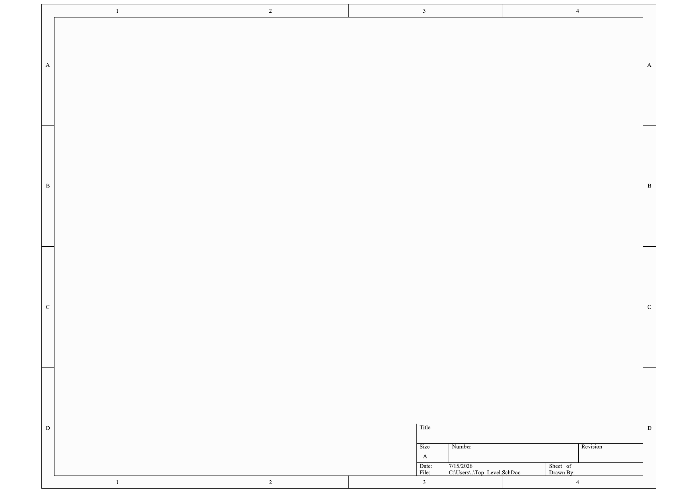

---

## Page 2 — Power Section (`01_Power.SchDoc`)

The whole board's power supply: one synchronous buck converter that steps battery voltage down to 3.3 V.

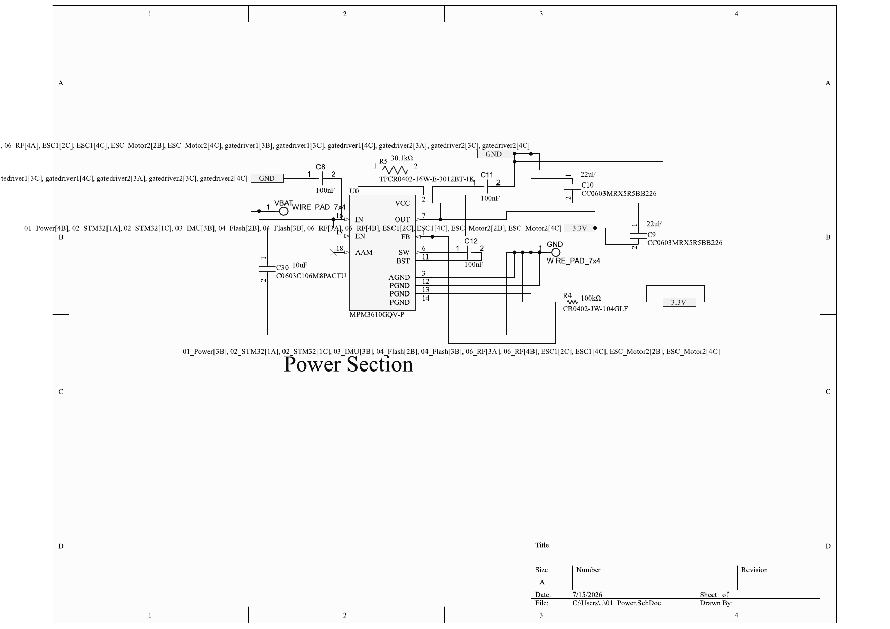

| Component | What it is | What it does here |
|---|---|---|
| **U0 — MPM3610GQV-P** | 21 V, 1.2 A synchronous buck converter module with the inductor built in | Takes VBAT (battery) on IN, produces the 3.3 V rail on OUT. Being a *module*, no external inductor is needed — that's why the sheet looks so sparse. |
| **VBAT / GND wire pads** | Bare solder pads (WIRE_PAD_7x4) | Where the battery leads solder onto the board. |
| **C30 — 10 µF** | Input capacitor | Smooths the battery input right at the regulator; buck converters draw current in sharp pulses and this reservoir supplies them. |
| **C8, C11 — 100 nF** | Ceramic decoupling caps | High-frequency noise filtering on the input/VCC side. |
| **C9, C10 — 22 µF ×2** | Output capacitors | Store the output charge and set the output ripple. Two in parallel halves the effective ESR. |
| **C12 — 100 nF** | Bootstrap capacitor (SW↔BST) | The buck's internal high-side switch needs a gate voltage *above* its input; this cap "bootstraps" up that voltage every switching cycle. |
| **R4 (100 kΩ) + R5 (30.1 kΩ)** | Feedback divider | Divides the output back down to the FB pin's 0.798 V reference — these two resistors are what *set* the output voltage. ⚠ **B1:** these values give 3.45 V, not 3.3 V; datasheet wants 102k/32.4k. |
| **EN pin** | Enable input | ⚠ **A4:** tied directly to IN, but EN is only rated to 6 V — needs a series resistor for any battery above 6 V. |
| **AAM pin (✕)** | Mode-select pin | Left floating — selects the default operating mode. |

Everything else on the board hangs off the `3.3V` net created here — you can see its enormous cross-reference list spanning nearly every sheet.

---

## Page 3 — Flight Controller MCU (`02_STM32.SchDoc`)

The brain: an STM32F411CEU6 (ARM Cortex-M4, 100 MHz, UFQFPN48 package) and its support circuitry.

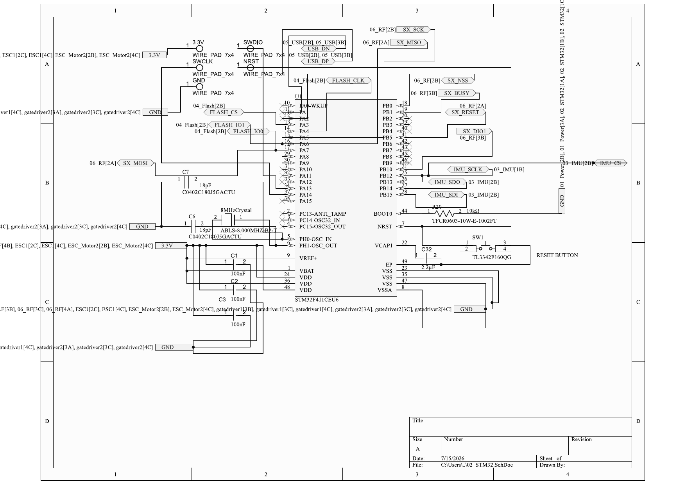

| Component | What it is | What it does here |
|---|---|---|
| **U1 — STM32F411CEU6** | 32-bit microcontroller | Runs the flight firmware: reads the gyro, computes PID, and (in theory) commands the motors. All its peripherals fan out from here via net labels. |
| **C1, C2, C3 — 100 nF** | Decoupling caps | One per VDD pin, placed close to the chip; they supply the instantaneous current spikes of digital switching. |
| **C32 — 2.2 µF on VCAP1** | Core regulator capacitor | Stabilizes the MCU's internal 1.3 V core supply. ⚠ **A9:** single-VCAP packages need 4.7 µF — this is half that. |
| **8 MHz crystal (ABLS-8.000MHZ-B2-T) + C6, C7 (18 pF)** | Main clock source | The crystal gives the MCU an accurate clock, multiplied internally by PLL to 100 MHz. C6/C7 are its load caps. ⚠ **B2:** these values land ~4 pF under the crystal's required load. |
| **R20 — 10 kΩ on BOOT0** | Boot strap | Holds BOOT0 low so the MCU always boots from its own flash. ⚠ Rotorflight wants a *button* here so users can force the USB bootloader (DFU). |
| **SW1 — TL3342 + pull-up** | Reset button | Grounds NRST when pressed — hardware reset. |
| **SWDIO / SWCLK / NRST / GND / 3.3V wire pads** | Programming pads | Where a debug probe (ST-Link) clips on to flash and debug the F411. |

Signal fan-out from this page (all via net labels):

- **SPI2 → IMU** (`IMU_CS`, `IMU_SCLK`, `IMU_SDI`, `IMU_SDO` on PB12–PB15). ⚠ **A6:** PB12 and PB13 are accidentally joined — CS and clock are one wire.
- **SPI1 → flash + radio, shared** (`FLASH_CLK`/PA4, `SX_SCK`/PA5, shared data on PA6/PA7, plus `FLASH_CS`, `SX_NSS`, `SX_RESET`, `SX_BUSY`, `SX_DIO1`). ⚠ **B5:** two clock pins on one shared data pair is not a valid SPI bus.
- **USB** (`USB_DN`, `USB_DP`). ⚠ **A5:** routed to PA1/PA2, but USB hardware only exists on PA11/PA12.
- ⚠ **A7:** conspicuously absent — any net going to the ESC MCUs. The flight controller has no way to command the motors.

---

## Page 4 — Inertial Measurement Unit (`03_IMU.SchDoc`)

The sensor that makes it a *flight* controller: a TDK ICM-42688-P 6-axis gyroscope + accelerometer.

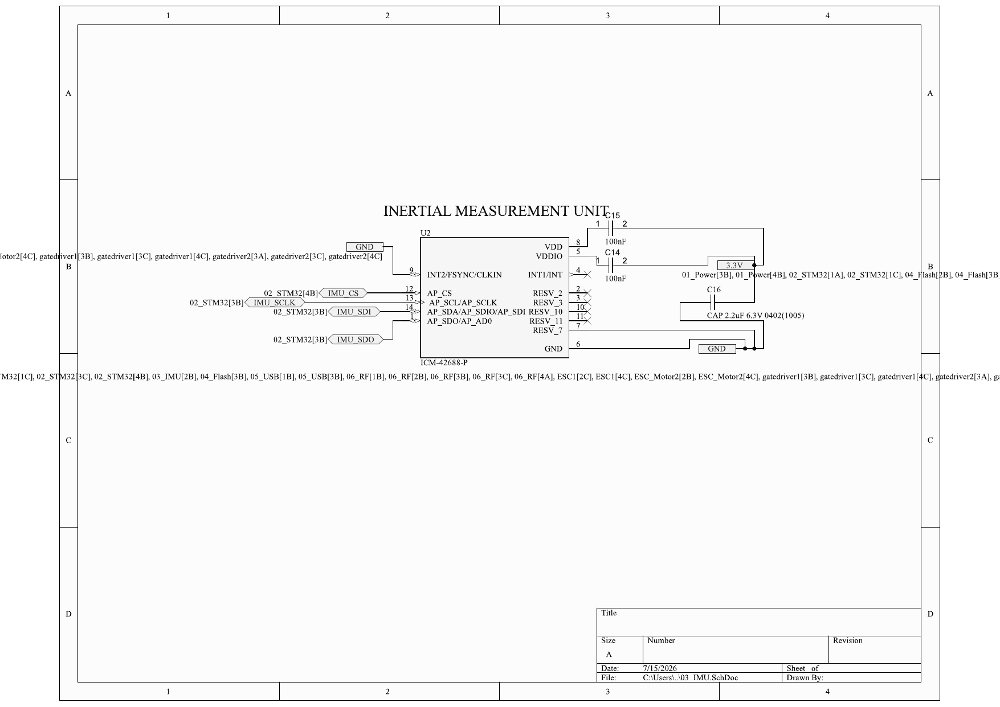

| Component | What it is | What it does here |
|---|---|---|
| **U2 — ICM-42688-P** | 6-axis IMU (3-axis gyro + 3-axis accel) | Measures rotation rate and acceleration thousands of times per second — the input to the PID loop. Talks to the F411 over SPI (AP_CS/AP_SCLK/AP_SDI/AP_SDO). |
| **C15, C14 — 100 nF** | Decoupling caps | On VDD and VDDIO respectively. |
| **C16 — 2.2 µF** | Bulk cap | Local charge reservoir for the 3.3 V feeding the sensor. |
| **INT2/FSYNC → GND** | Second interrupt / frame-sync pin | Tied low = unused, which is fine. |
| **INT1/INT (✕)** | Data-ready interrupt | ⚠ **B4:** left unconnected. This pin pulses when a new gyro sample is ready; flight firmware runs its control loop off that pulse. Without it, the firmware must poll. |
| **RESV pins (✕)** | Reserved pins | Correctly left unconnected per the datasheet. |

---

## Page 5 — Flash Memory (`04_Flash.SchDoc`)

Blackbox storage: a Winbond W25Q128JV 128 Mbit (16 MB) SPI NOR flash.

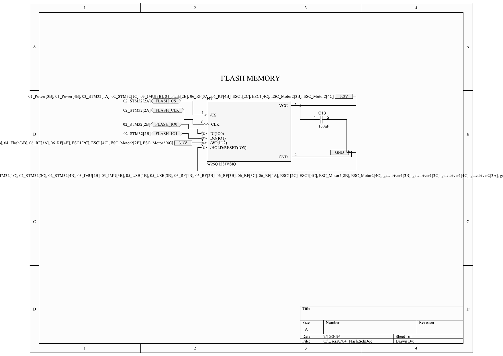

| Component | What it is | What it does here |
|---|---|---|
| **U3 — W25Q128JVSIQ** | 128 Mbit SPI flash | Stores blackbox logs — high-rate recordings of gyro/PID data used for tuning. Connected to the F411 via `FLASH_CS`, `FLASH_CLK`, `FLASH_IO0` (DI), `FLASH_IO1` (DO). |
| **C13 — 100 nF** | Decoupling cap | Standard supply bypass. |
| **/WP and /HOLD → 3.3V** | Write-protect and hold inputs | Tied high = never write-protected, never held. Correct for normal use, but it also means the chip is locked to plain dual-IO SPI (its quad mode would need these pins as IO2/IO3). |

⚠ Rotorflight note: it lists the W25Q128 as "supported but not large enough" for blackbox — the recommended part is the 1 Gbit W25N01G.

---

## Page 6 — USB Connector (`05_USB.SchDoc`)

The configuration/flashing port: a USB-C receptacle wired as a device (UFP).

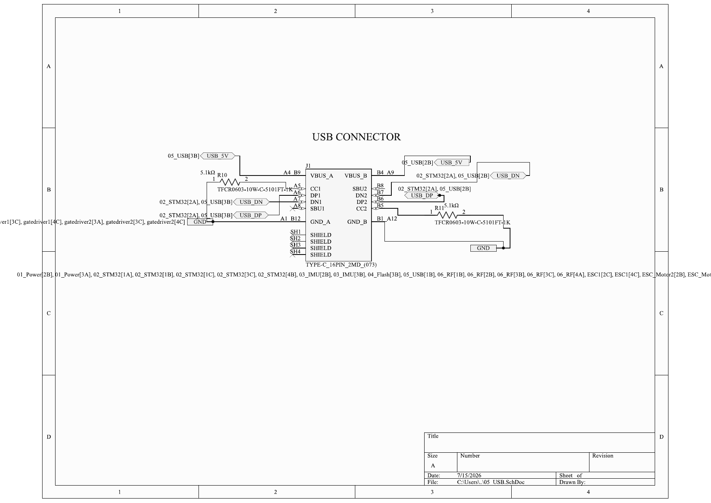

| Component | What it is | What it does here |
|---|---|---|
| **J1 — 16-pin USB-C receptacle (TYPE-C_16PIN_2MD)** | Connector | Physical USB port. Both orientations of the plug are handled: DN1/DP1 and DN2/DP2 pairs are joined so either flip works. |
| **R10, R11 — 5.1 kΩ on CC1/CC2** | Configuration-channel pulldowns | This is how a USB-C *device* announces itself: 5.1 kΩ pulldowns on both CC pins tell the host "I'm a device, give me 5 V." Correct values. ✓ |
| **`USB_5V` net** | VBUS from the host | The 5 V a computer supplies. Note from its cross-reference list: it goes nowhere except this sheet and page 3's label — it does **not** power the board. Plugging in USB without a battery does nothing. |
| **SBU1/SBU2 (✕), SHIELD** | Sideband pins, shell | Correctly unused; shield grounded. |

⚠ **A5** lives on the other end of `USB_DN`/`USB_DP`: on page 3 they land on PA1/PA2, where no USB peripheral exists.

---

## Page 7 — RF Transceiver (`06_RF.SchDoc`)

The radio link: a Semtech SX1280, the 2.4 GHz chip that ExpressLRS receivers are built on.

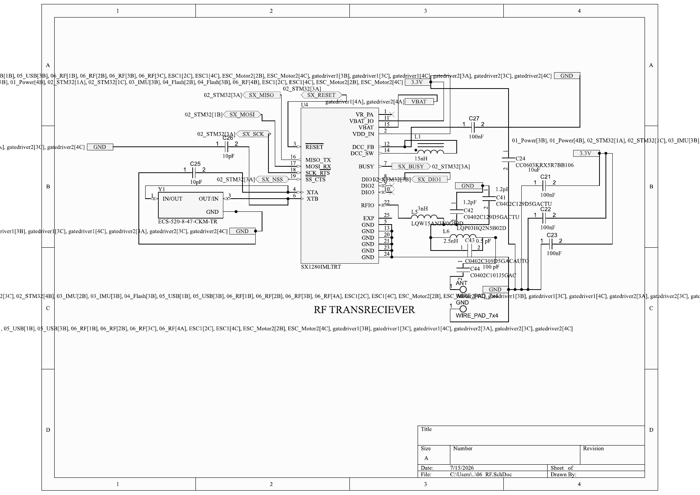

| Component | What it is | What it does here |
|---|---|---|
| **U4 — SX1280IMLTRT** | 2.4 GHz LoRa/FLRC transceiver | Meant to receive the pilot's stick commands directly on-board (SPI-ELRS style). Talks to the F411 over SPI (`SX_SCK/MISO/MOSI/NSS`) plus control lines `SX_RESET`, `SX_BUSY`, `SX_DIO1`. |
| **VR_PA, VBAT_IO, VBAT, VDD_IN pins** | Supply inputs | ⚠ **A1:** all fed from the raw battery net. These pins max out at 3.9 V absolute — 2S battery voltage destroys the chip at power-on. |
| **Y1 — ECS-520-8-47-CKM (52 MHz) + C25, C26 (10 pF)** | Reference crystal + load caps | The radio's frequency reference. 2.4 GHz channels are synthesized from this 52 MHz. |
| **L1 — 15 nH on DCC_SW/DCC_FB** | DC-DC inductor | The SX1280 has an internal buck converter for efficiency; this is its external inductor. |
| **C27, C21–C23 (100 nF), C24 (10 µF)** | Supply decoupling | Bypass caps on each supply pin plus one bulk cap. |
| **L (1.5 nH, 3 nH), L6 (2.5 nH), C41/C42 (1.2 pF), C43 (0.5 pF), C44 (100 pF)** | RF matching network | Between the RFIO pin and the antenna pad: transforms the chip's impedance to 50 Ω and filters harmonics. These tiny values are normal at 2.4 GHz. |
| **ANT wire pad** | Antenna connection | Where the 2.4 GHz antenna attaches. |

⚠ Rotorflight note (Section D of the review): even with A1 fixed, Rotorflight 2 has deleted SPI-SX1280 support from its code — the supported route is a self-contained serial ELRS receiver on a UART. This whole page likely gets replaced by a 4-pin serial receiver header in Rev B.

---

## Pages 8 & 9 — ESC Microcontrollers (`ESC_Motor2.SchDoc`, `ESC1.SchDoc`)

One STM32G071GBU6 per motor. Page 8 is ESC2 (IC2), page 9 is ESC1 (IC1) — they're identical mirror copies.

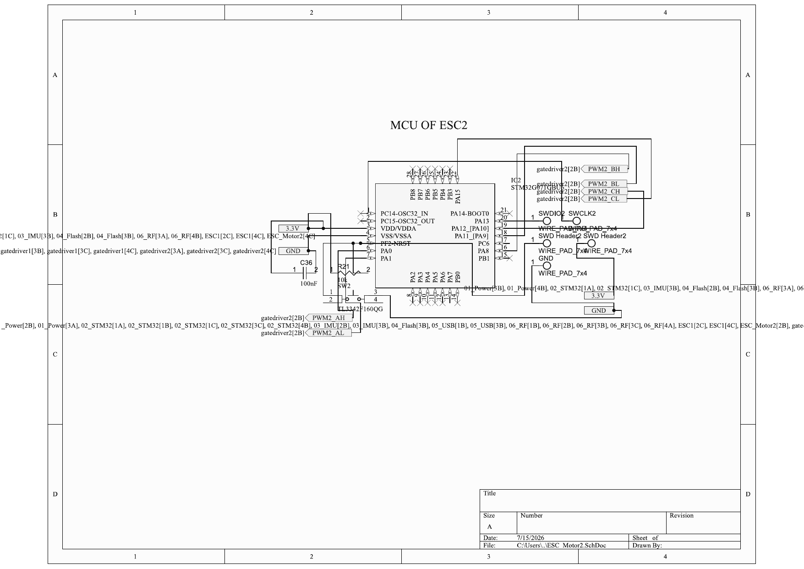
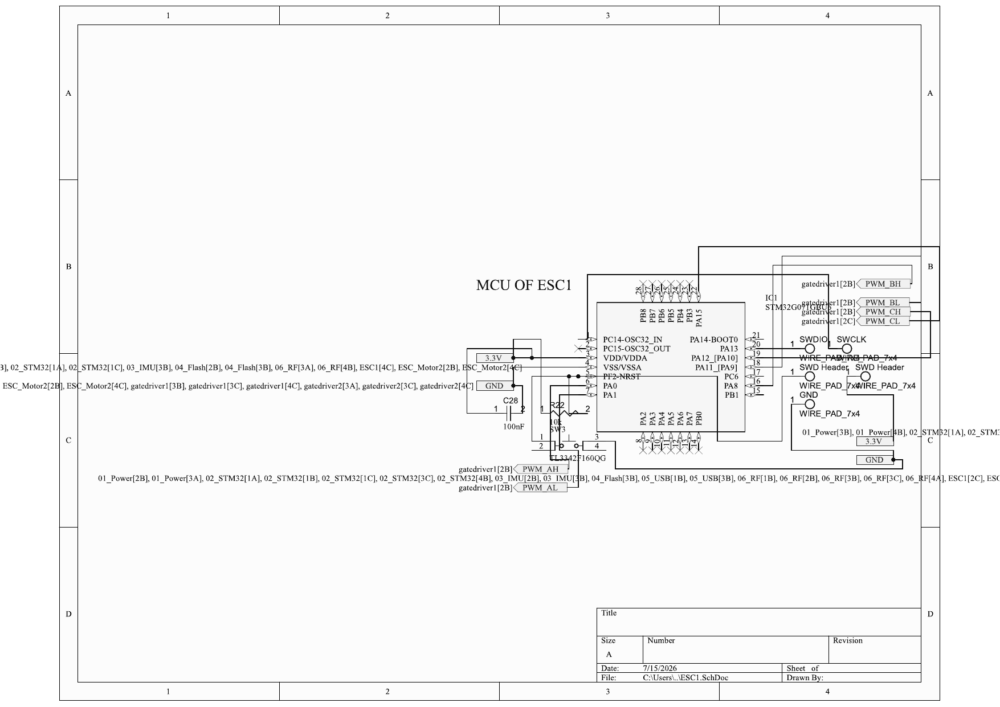

| Component | What it is | What it does here |
|---|---|---|
| **IC1/IC2 — STM32G071GBU6** | Cortex-M0+ MCU, 64 MHz | Dedicated motor-control processor. Its job: take a throttle command and generate the six precisely-timed PWM signals (`PWM_AH/AL/BH/BL/CH/CL`) that step the motor through its commutation sequence. |
| **C36 / C28 — 100 nF** | Decoupling caps | Supply bypass on VDD. |
| **R21/R22 (10 kΩ) + SW2/SW3 (TL3342)** | Reset pull-up + button | Hardware reset for each ESC MCU. |
| **SWD wire pads (SWDIO/SWCLK ×2, GND, 3.3V)** | Programming pads | For flashing ESC firmware. ⚠ **A8:** the SWCLK pad wires route to PC14 (a crystal pin) instead of PA14 (the actual SWCLK) — as drawn, the chips can't be programmed. |
| **PWM output nets** | `PWM_AH…CL` / `PWM2_AH…CL` | The only connected signal pins. Each "H/L" pair drives the high-side/low-side inputs of one half-bridge on the gate driver sheet. |

Two structural problems live here:

- ⚠ **A7:** no net from the flight controller arrives at either G071 — there's no throttle input. The right-side pins (PA8–PA13, PC6, PB1) that could receive it are all no-connect.
- ⚠ **B3:** every ADC/comparator pin (PA2–PA7, PB0, bottom row) is no-connect — the MCU can't see motor back-EMF or current, which sensorless BLDC control requires.

---

## Pages 10 & 11 — Gate Drivers + Power Stages (`gatedriver1/2.SchDoc`)

The muscle: each page is one complete three-phase inverter — a gate driver chip and six MOSFETs that switch battery current through the motor windings. Page 10 drives motor 1 (ESC1's signals), page 11 drives motor 2. Identical circuits, so described once.

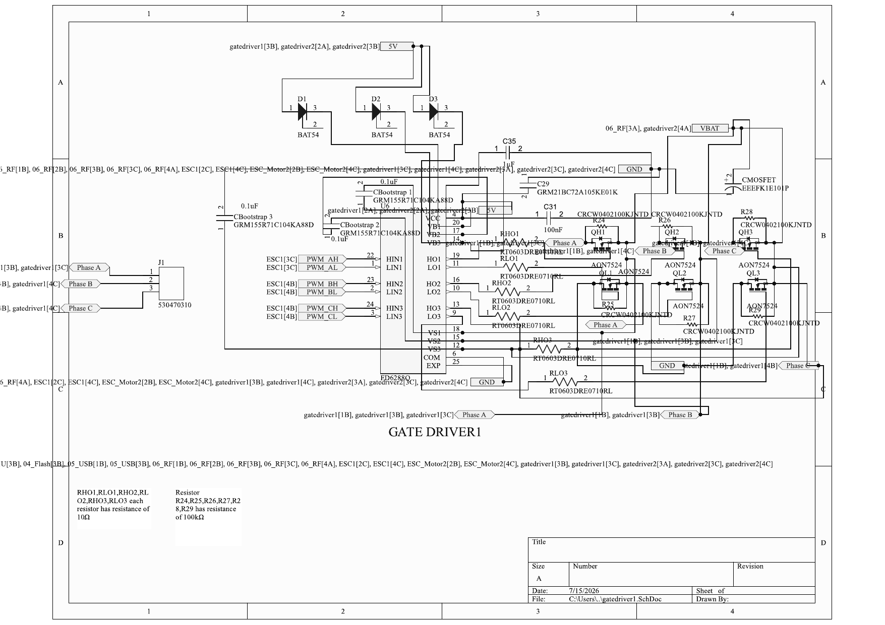
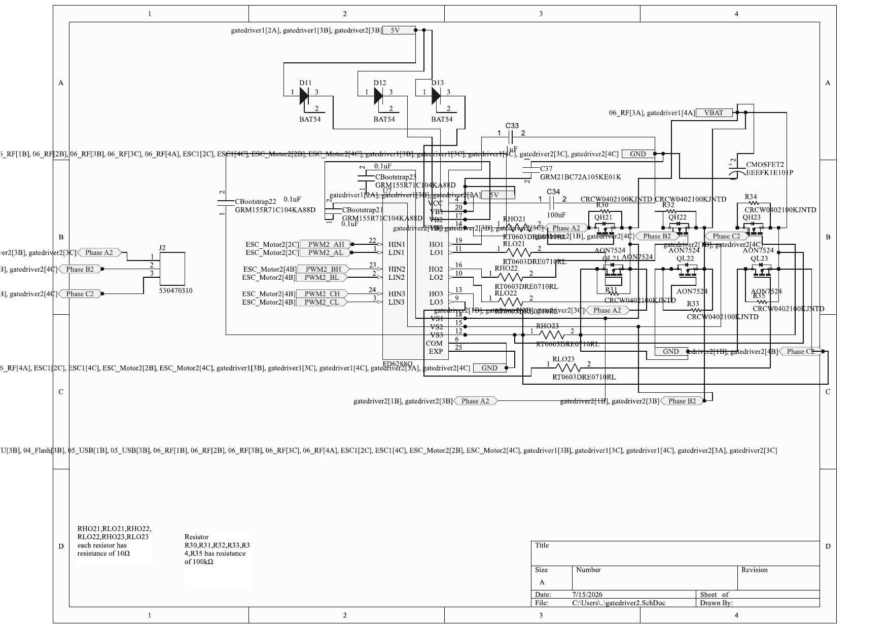

How a three-phase bridge works, in short: the motor has three wires (Phase A/B/C). Each phase connects to the midpoint of a "half-bridge" — a high-side MOSFET up to VBAT and a low-side MOSFET down to GND. By switching the right high/low pairs in sequence, current is steered through two windings at a time, dragging the rotor around. The gate driver translates the MCU's six 3.3 V PWM inputs into gate drive strong enough to switch the MOSFETs cleanly.

| Component | What it is | What it does here |
|---|---|---|
| **U6/U7 — FD6288Q** | Three-phase gate driver | Takes HIN1–3/LIN1–3 (the six PWM signals) and drives six MOSFET gates via HO1–3/LO1–3. Has built-in dead-time and shoot-through protection so a high and low FET of the same phase can't conduct simultaneously. ⚠ **A2:** its VCC sits on the phantom `5V` net that nothing generates — the drivers are unpowered. |
| **QH1–QH3 — AON7524** | High-side MOSFETs | Connect each phase to VBAT when on. |
| **QL1–QL3 — AON7524** | Low-side MOSFETs | Connect each phase to GND when on. (30 V, ~4 mΩ parts — ⚠ **B6:** the headline 25 A rating assumes 1 in² of copper per FET; real rating on this board is far lower, but fine for nano-UAV currents.) |
| **D1–D3 — BAT54 + CBootstrap1–3 (0.1 µF)** | Bootstrap diodes + caps | The trick that powers high-side gates: when a phase swings low, the cap charges through the diode; when the FET must turn on, that stored charge drives its gate *above* VBAT. One diode+cap per phase, feeding VB1–VB3. |
| **RHO1–3, RLO1–3 — 10 Ω** | Gate series resistors | Slow the MOSFET switching edge just enough to tame ringing and EMI. |
| **R24–R29 (page 10) / R30–R35 (page 11) — 100 kΩ** | Gate bleed resistors | Pull each MOSFET gate to its source so the FETs stay firmly OFF while the driver is unpowered or starting up. ⚠ **B3 note:** these are *not* voltage-sense dividers — no measurement point comes off them. |
| **VS1–VS3 pins** | Phase-voltage sense inputs (of the driver) | Let the FD6288 track each phase's flying midpoint so it can drive the high side correctly. |
| **CMOSFET — EEE-FK1E101P (100 µF electrolytic)** | Bulk bus capacitor | Sits on VBAT next to the bridge; supplies the big current pulses the motor draws each PWM cycle so the battery leads don't ring. |
| **C35 (1 µF), C31 (100 nF), C29 (1 µF)** | Driver decoupling | Local bypass for the driver's VCC. |
| **J1/J2 — Molex 530470310** | 3-pin motor connectors | Where the motor's Phase A/B/C wires plug in. |
| **COM/EXP → GND** | Driver ground / exposed pad | Return path and thermal pad. |

---

## Where the design stands

Wiring-wise, the board is four fixable mistakes away from being a coherent AIO: power the gate drivers (A2), connect the FC to the ESCs (A7), fix the IMU short (A6) and the USB pins (A5) — plus the smaller value fixes (A4, A9, B1, B2, B4). Architecturally, two bigger decisions are pending for Rev B: moving off the F411 (EOL in Rotorflight) and replacing the SPI SX1280 with a serial ELRS receiver. The complete reasoning and fix list is in the [Design Review Threshold Report](../AIO_Flight_Controller/Design_Review_Threshold_Report.md).
